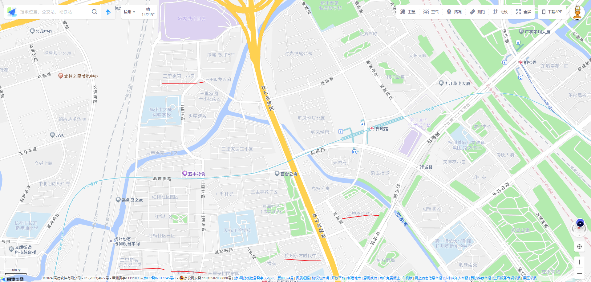
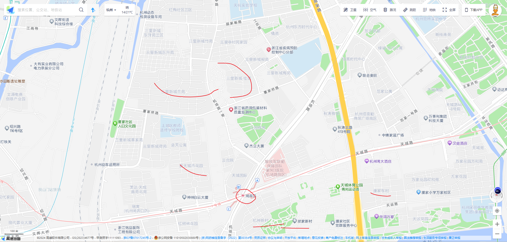
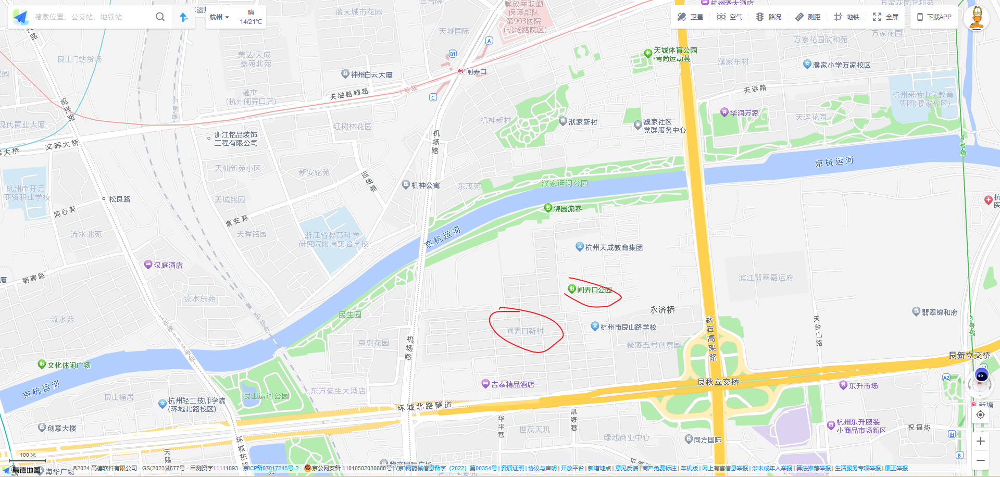
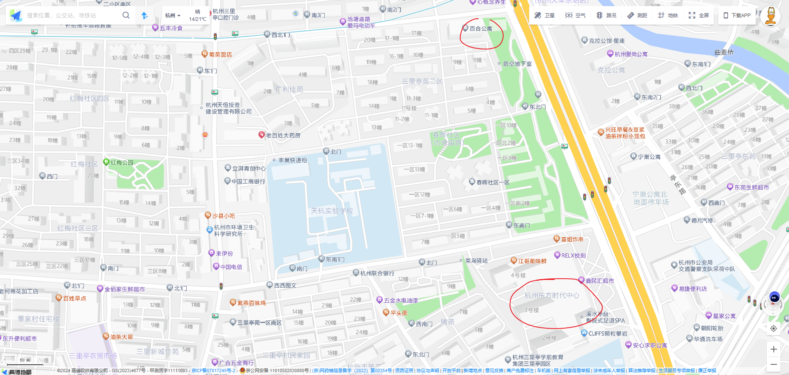
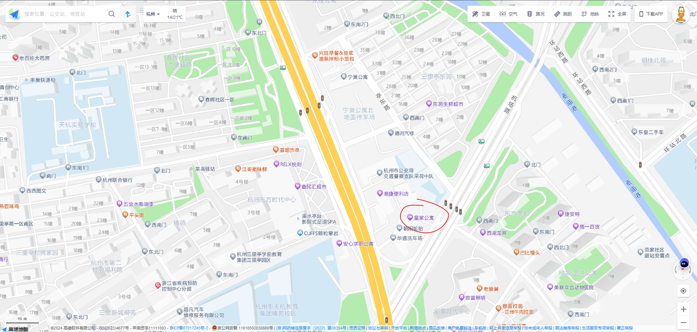
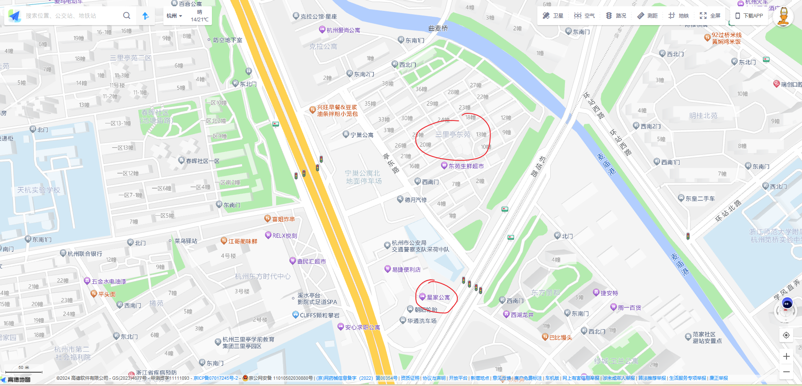
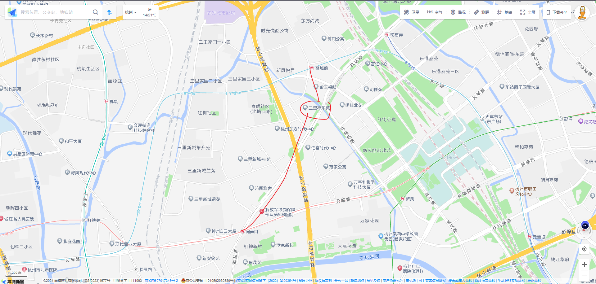
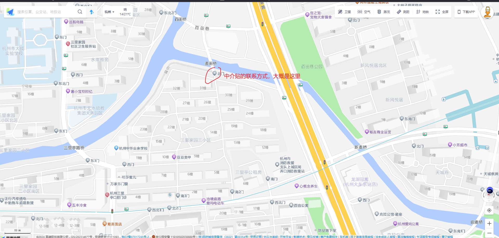

# 三里亭租房记

闸弄口地铁站附近是原先是三里亭所在处，三里亭过去可能是一个村庄，我也不清楚，现在闸弄口地铁站附近很多的小区都是带有三里前缀的，比如三里新城，三里家园等，这些大的小区，又会具体分下去，比如兰苑，桂苑之类的，总之带三里的小区多不胜数，而且不带三里的小区，或者商业楼大概率也是属于三里亭这个地方的，

这里附近再比较有名的老小区有闸弄口新村，机神新村，洑家新村，濮家东村等，我怀疑这里也是三里亭，都是后来城市化进展下产物。

9月10日那天，我中午刚回到杭州，还没来及把发票整理完，便和多个月前联系过的大妈约看房，杭州的雨是越下越大，我乘坐2路公交车到北景园小区终点站下，然后又骑车到达新华集团创意园附近和大妈碰头，她带我看了两间公寓，一间1600，一间1800，然后我想考虑一下，但是这个在微信聊天还很热情的大妈，突然就性情突变，一直逼迫我赶紧选定一个交钱，而我则一直是拒绝的态度，不可能我看一两间房子，然后就下决定，况且这里实在是太偏了，大妈见我一直不肯下决定，有些恼羞说我脑残。

9月11日那天，我休息到中午时才起床，在三里亭村民家园那里的左邻右舍小饭馆吃了饭，然后在外面溜达到红梅社区转了下，除了看到聚拢在一块打牌的老年人外，没有看到租房的告示，也不清楚附近开餐馆的夫妻们都是怎么在红梅社区找的房子。稍后我在三里亭路转入亭苑街，随意的骑行到池塘庙路大门出口，凑巧这里有一个百合公寓。

我在百合公寓那里看到了一些租房告示，联系了下，在三里亭苑二区的一幢楼里看了一间一楼的房子，不怎么满意，公共地方只能几个平方，独卫的房间破旧难闻。出来之后又在百合公寓那里碰巧碰到一个身体壮硕，很有生命力的穿着黑色背心的男子，他得知我是找房时，便把我带到他另外两个朋友租的一间房子，看我是否愿意转租下来，那是一件大概10平台左右的单间，放了一张小床，空间没有多大，租金是700块钱一个月，听到这么低的租金后，我吓了一跳，在这附近能找到这么一间便宜的还算不错的房子，这钱绝对值了，他俩住的这一间房子租期还没有到期，想转租给我，我看着这么一间狭窄的空间的房子，给拒绝了。

接着我又溜达到东方时代那里，看了一间不错的公寓，大概20平的样子，月租2100多块钱，这里的公寓环境确实不错，公寓都是在商业楼里面的，宽敞的楼道两边是一间接着一间的的房间，每个房间采光，以及卫生间的都不错，能在这里居住确实不错，只是我肯定不会花超过2000块去租房。

接着我又联系了一位中介，穿过秋石高桥路看下星家公寓的房子，星家公寓的房子大多在1600到2000之间，我到了之后才知道一分钱有一分钱的道理，这个星家公寓质量确实不咋样，也不知道这个地方以前是干嘛的，现在它的下面是一个洗车场，星家公寓也没有电梯，得步行上去，楼梯特别宽敞，特别大，不知道以前这里是干嘛的，楼道上有些狭窄，没有什么阳光，曲折的两边墙上都是白色的墙漆，这楼道有点阴森，中介带我看了几个房间，每个房间都是那种很阴凉，没有什么阳光样子，一个小窗户最多可以透风，这里的房间感觉都很脆弱，我估计都是隔断出来的，如果你去过便宜的宾馆，你就能大致想像这里的样子了。不过老实说这价格也可以了，一个20平左右的房间，独卫，1700左右。

从星家公寓出来，我碰巧到了三里亭东苑，这个真是奇怪，这个城中村我以前竟然不知道，一个人在大城市生活，有时间活动范围也就是自己周围一点而已，出了没多远，就完全陌生了。三里亭东苑算是一个城中村，这里都是一个村的村民，每家大多数都是老人在家，我想可能是他们的子女都搬到比较好的小区了，这里每栋人家的布局都是一楼是普通村里的大门，而二层到五层，每层有几个房间，每个房间或大或小都是独卫，这些房间都是对外出租的。1600到1700的价格可以租一个25平左右的独卫房间，最好的房间肯定得是三楼和四楼，二楼即使你的房间朝南，但是由于二楼平层是房东自己晒衣服用，他们都用棚子给盖起来了，这样直接导致即使是二楼朝南的房间，也是终日不见阳光。三楼还有四楼则稍微好些，一间房间没有阳光，很容易生病的。除了1600到1700的价格的房间，还有就是15平左右，甚至是10平左右的房间了，这些小房间依旧是独卫，价格也是便宜，大致在1000左右，甚至1000往下。这里离19号线驿城站不远，离闸弄口地铁站也不算远，骑车大概10分钟的时间。这里周围环境清静，三里亭东苑后面就是麦庙港，岸上是一条不长的散步小道，有一些运动器材，一个长亭，晚上时这里还有一些夜跑的人，在这里居住，倒是一个清静的的地方。

我在三里亭东苑几乎挨家挨户的找房子看，看到了晚上差不多九点了，才离开，我打算在这里租房住。晚上在麦当劳吃饭时，我把自己的情况给昨天带我看房的大妈说了。然后她生气的给我要辛苦费，说她虽然没有给我找到房，但是她这几天很辛苦，她这话一说，直接把我搞的没胃口吃饭了，她可是从来没有说过收费的事情，和她扯了一会，我直接把她微信删除了。

9月12日那天，我穿过城东桥，去了趟闸弄口新村，闸弄口新村是真的大，它没有封闭的大门，各种车辆可以自由进入，我骑车在里面，完全感觉不到这是一个小区，倒像完全开放的街区而已。这里的房子真的是好旧，好破，我还打算在这里找房租，还是算了。之后我又跑到三里亭家园那里转了下，在外面的的白纸打电话问租房信息时，碰巧其中一位是我爱我家的人员，她带我看了下百合公寓的一个单间，月租1200，民用水电费，有公共厨房，总共四个房间，其中一个是独卫，这个单间大概是20平左右，靠着厕所，厕所很脏乱，如果住在这里，我害怕又是来回的厕所洗漱声，但是它真是便宜啊！

这样一来，我便开始纠结了，住百合公寓这里比三里亭东苑能便宜了500块钱，我一直纠结在晚上，和中介一直在扯，最后中介的底线才知道，那里压一付三，或者压二付一，不可能压一付一，另外需要付一定比例的中介费给我爱我家，我爱我家的房子好像是自己在经营，他同时赚房东和租客的钱，而像巴乐兔则是直接给房东找房子，从房东那里抽取佣金，不收租客的钱。纠结到晚上，我也没打定主意。

9月13日号那天，我都忘了今天都干嘛了，只记得晚上里去三里亭东苑那里，先看了一间我11号第一次看的房子，先是和男主人说定1650，压一付一，只是下来到客厅之后，正在做饭的女主人坚决不同意，说他们是新装修的，1700，一块钱也不少，然后我就出去了。我11号过来看的房子很多，拒绝的也很多，也不好意思再找他们。今天中午过来第二次看的那间感觉房间太小了，又不想租。此时又想起有一个房子又租客应该搬走了，我便顺着记忆找到了那一家。

刚好男主人在，他带我看了下，我一看，还挺干净，面积也大，月租1600，压一付一，我欣然答应，等到女主人回来，他们说着一口我完全听不懂的本地话，不过没关系，就几分钟我们就把合同签了，我当场转了3200块钱过去，同时又给他们要了wifi密码，此时感觉终于找好房子了。

我回到蓝天城市花园，爬到六楼，心想以后再也不用爬楼梯了，我折腾半天才把我所有东西打包好提到楼下，之后叫了辆货拉拉，大概40块钱，到三里亭东苑，又是折腾一番到提到房间，中间实在没有力气了，我没有洗漱，直接躺床上睡着了。

9月14日那天，白天的时间才发现问题，这里是二楼，虽然朝南，但是一天下来没有什么阳光，更要命的是地板上面是贴了一层纸，有些地方已经凹下去了，我昨天晚上见地板上盖了一些塑料板，我还以为是原来的女租客爱干净，原来不是，而是这里凹下去了，得有塑料板垫着，这纸板我稍微看了下，有些已经脱离下面的板了，纸板后面是潮湿黏液，这里肯定是不能拖地了。操，我没有发现这些。

我先是问房东是否可以把纸板撕了，他们说不行，我在这个房间待了一会，实在是受不了了。这房子我完全住不了，下午时又找房东说要搬走，女房东在外面十分生气，此时她终于说我听得懂的普通话了，一个同样上了年纪的大爷也在附和说房子还行，你住着呗，我是怯怯的不同意，最后女主人说，扣我500块钱，我想都没想就答应了。

我又想到百合公寓的1200的房子，但是中介微信我已经删除了，没办法我又在网上找我爱我家的人，但是这个新的员工，关于租房的一些东西就有些不一样了，像收费之类的，我更无语了，怎么换了一个人，说话就变了，我又跑到前天那个贴着白纸的地方，找到第一次带我看百合公寓那个1200块钱那个中介，此时已经下午六点多了，好折腾人，最后签了合同，五个月，压二付一，中介费360。

我又从三里亭东苑把先要折腾到百合公寓，累的快死了，我理解不了像父辈一样的体力劳动者是怎么坚持干体力活的，我就提了几个行李带，现在就累的起不了。我也没力气来收拾放在大厅里的行李了。回到简陋的房子，倒头便睡！

9月15日那天，想想还是三里亭东苑的房子不错，1600到1700左右就能租一个25平左右的独卫房间，前提得是三层或四层朝南的房间。我昨天本来打算换另一个人家，但是他们都是同一个村子的，我也不好意思了。现在这个百合公寓的房子便宜是便宜的，但是住着真不爽的。这个房子是二室一厅，然后大厅隔出来了两间，变成了四室，还有一个不大的大厅，和一个厨房，其实这样的布局不错了，像三里亭闸弄口附近的房子，条件比这恶劣恶心的多的去了，况且这里只有1200的租金。但是也有不尽人意的地方，相比而言，多个500块钱在三里亭东苑租一个独卫的更爽。

我租的单间挨着厕所。那是真的不爽，晚上洗漱声肯定有，我得戴着隔音耳机，但是隔音耳机戴旧了，耳朵又不舒服。这个卫生间也真是短处一大堆，它的水龙头热水流速大，但是它的凉水流速小，小到令人发狂的程度，我双手捧着，那像插电板电线一样粗细的水流像没有似的从我双手中间漏掉。更离谱的是它这里的淋浴空间小，而且玻璃挡也没有了，这样淋浴时，水就会喷溅到淋浴台外面，重点是整个卫生间排水口只有淋浴台上有，我TM的还是第一次见到这种反人类设计，这样一来，每次淋浴完，还得用拖把把淋浴台外面积聚的大量水给拖到淋浴台上的排水口。

