# 先照禅寺略记

> 农历 七月初七 甲辰 [龙] 年 壬申月 丙午日

我是费了好大的劲从湘湖路沿着坡度很大的弯曲山路到山顶上的先照禅寺的，中间可能是酷热的天气，可能是我虚弱的身体，也可以是弯曲且坡度大的山路，我犯起了胸闷气短的症状来了，那感觉难受的我马上要晕死过去的状态了。到了先照禅寺里面，即使买了几瓶矿泉水喝，胸闷气短的症状也没有立即缓解下来。

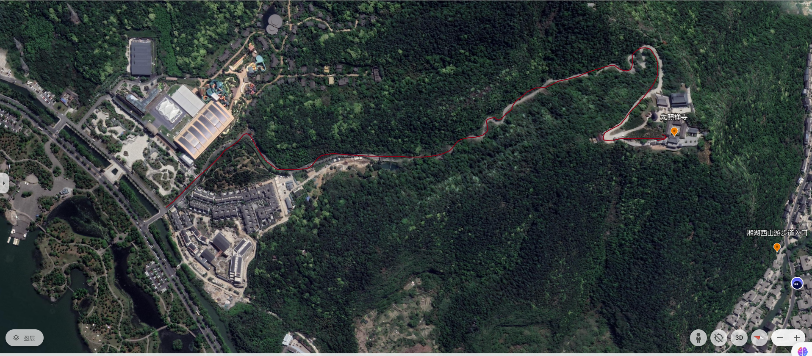

先照禅寺位于山顶上，整体布局也没有位于中轴线上。先照禅寺的位置极佳，在天王殿前的空台上远处的湘湖尽收眼底，再远处视野看去，则是湖水流入天际消失在一片朦胧雾气之中的。每次站在高处，极尽远目视野尽头那些模糊的山，模糊的城市，模糊的云雾，总是有种莫名的感慨。在空台上另一个角度来看，近些的山下则是一些小层的高楼，和城市里动辄三十多层高的恐怖高楼相比，实在是好多了。

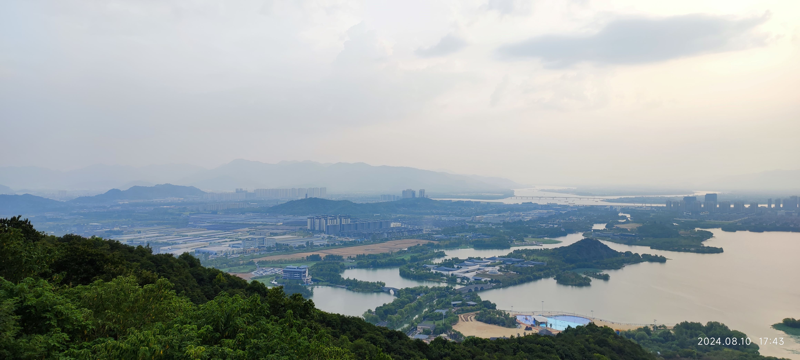

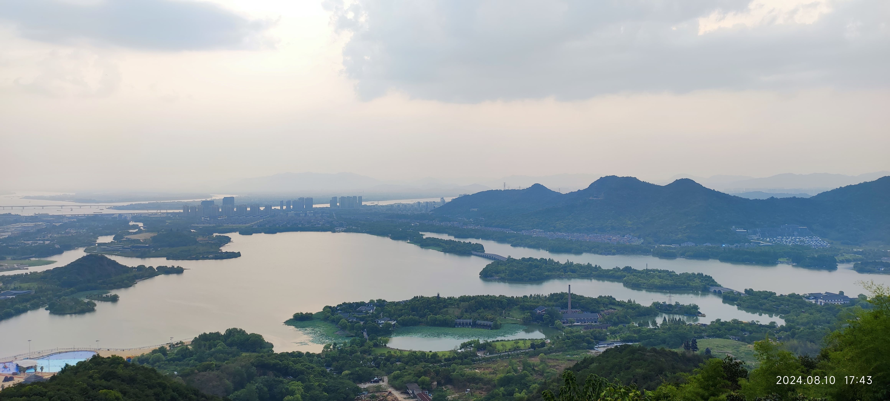

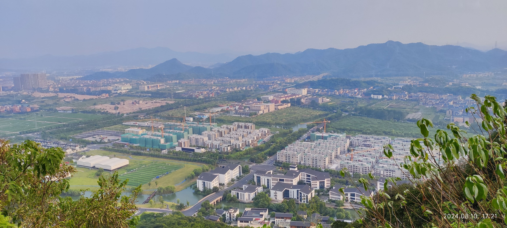

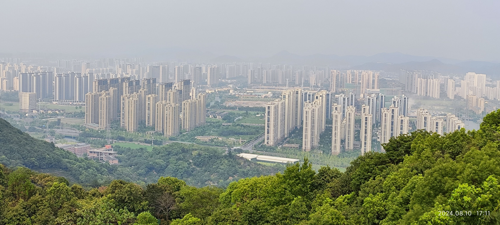

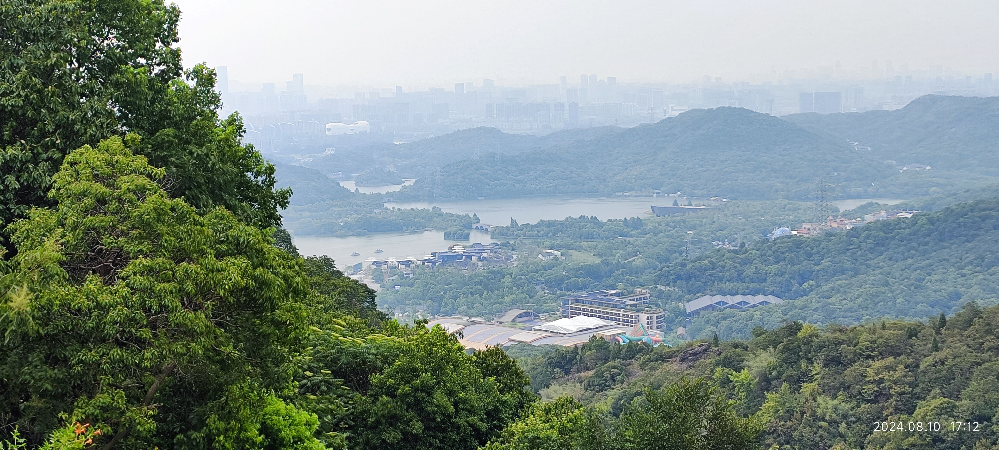

先照禅寺不是什么雄伟的大寺庙，它的建筑都很平常。自然天王殿也没有多大，但是四大天王这些菩萨还是有的。而且里面上的木柱上也多写有对联：

> 护法安僧亲受云山咐嘱
>
> 降魔伏虎故现天降威风

> 山门冷烟总见他欢天喜地
>
> 布袋空携卻剩得大肚宽肠

出了天王殿，沿着汉白玉的石阶上去便是大雄宝殿，北侧是祖堂，南侧是客堂，大雄宝殿后门有一尊斜卧着的佛像，身上盖着金色的被子，对此我感到很奇怪。

出了大雄宝殿后面便是大圆通殿了，大雄宝殿和大圆通殿之间并没有平行，而是斜着的，这真有点奇怪。大圆通殿前门有对联：

> 圆满十方观千手眼而济渡
>
> 通逢三世具大慈悲以舟航

大圆通殿中间立有千手观音像，其最上面的穹顶则是刻有游龙的壁画，颇有些西式宗教的意味。大圆通殿内木柱上写有多个对联：

> 大发慈悲普渡众生登彼岸
>
> 士林敬仰同修佛果证前因

> 观以无心何来何去何自在
>
> 音非法像是空是色是圆通

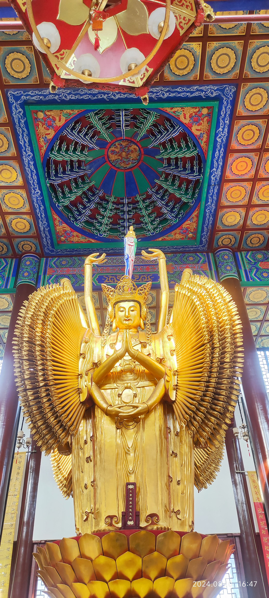

大圆通殿的北侧是广照殿，广照殿的正门不是和大圆通殿，大雄宝殿面向西侧，它的正门则是面向东侧，我想可能是东侧可以远眺远方的风景缘故吧，这个时候我胸闷气短的症状还是没有大的好转。广照殿的正门前写有对联：

> 广照无边泽被千秋万古越
>
> 高？极项身？一览？新湘

广照殿里面供奉的佛像，我看着有点像道教。里面木柱上写有对联：

> 钦承佛勒共输诚拥护法王城
>
> 合寺威云？？屏梵刹永安宁

广照殿后门写有对联：

> 七行五？？越？孤忠遥？烟波舟上宫
>
> 三教千？？财门大德敬沾福？？中身

看完广照殿，突然起了劲风，佛铃在风的拂动下响起了金属撞击的声音，这个真是好风，吹过来之后，我胸闷气短的症状即刻缓解了不少。寺庙内还有一座七层的佛塔，佛塔的南侧种植有一棵结了石榴果子的石榴树，一棵开了紫红色紫薇花的紫薇花树。

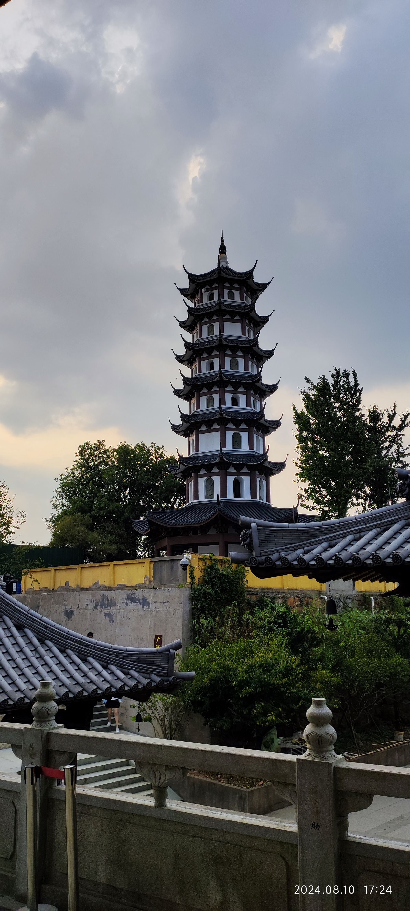

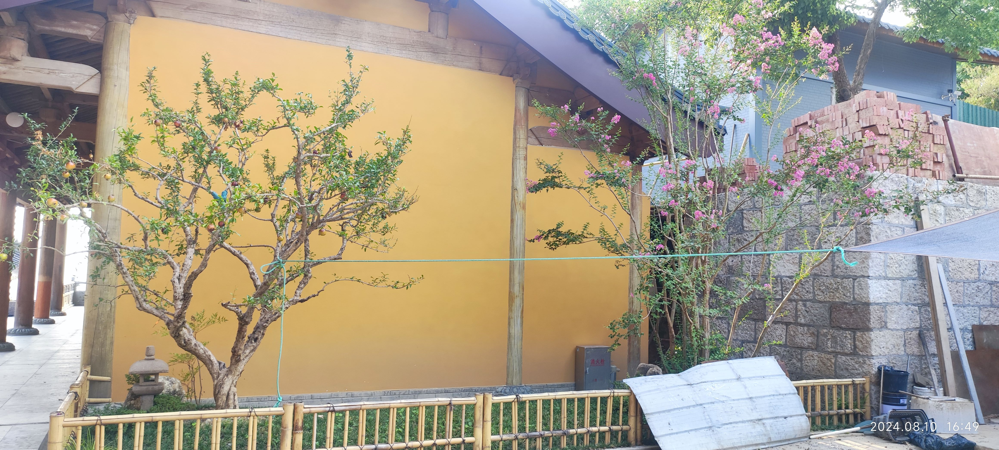

出了寺庙，在天王殿前面的空地上，许多的人都在这里眺望远方的风景，这个时间点，太阳快落山了，夕阳带着红色快速的湮没在西方无尽的云层之中。我待了一会，顺着南侧的下山路下山了，这次没有走刚上来时坡度大的山路，而是沿着有台阶的山路下山了。

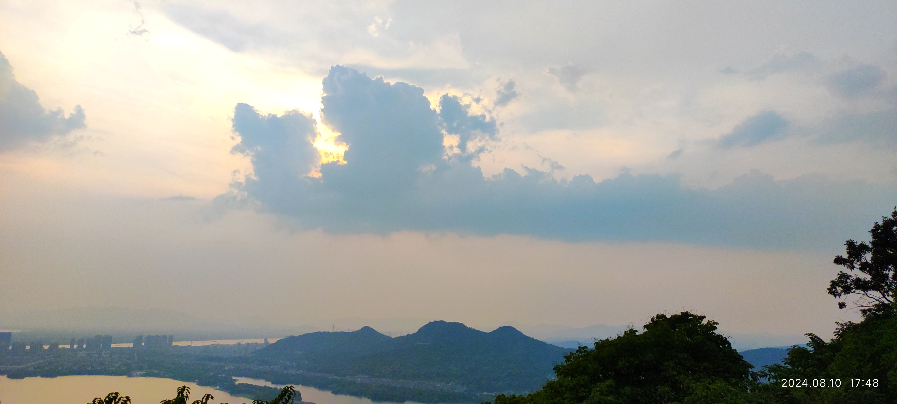

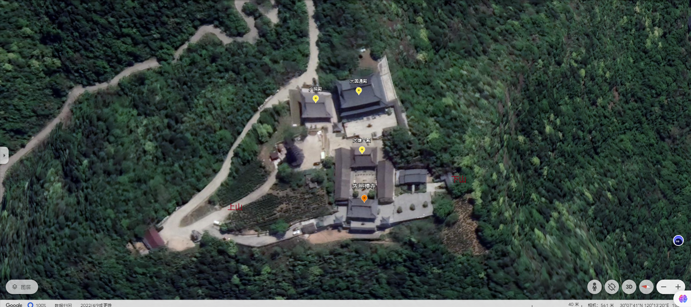

