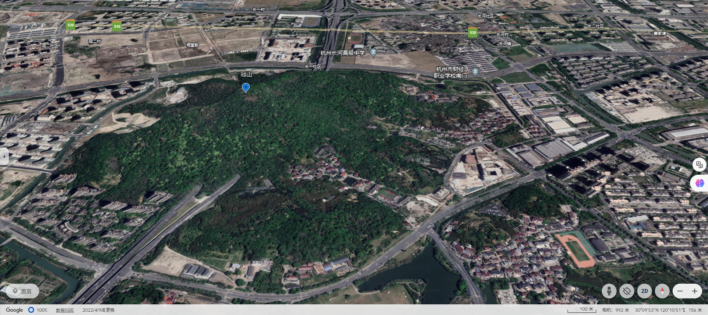

# 冠山禅寺略记

冠山位于城市之中，乘坐公交很方便的就能到这里，冠山仅是一座160米左右高度的小山，既然是小山，便容易修整，人们自然把它修建成了舒适的公园，冠山山脚下又多是一些小区和办公楼，此处生活和工作的人们闲暇时在这里散步实在是一个非常不错的消遣，再加上山上的一处冠山禅寺，在这个依山而建的住处生活真的是一种稀有的享受。

冠山禅寺在冠山东北角，整体建筑位于东西中轴线上，大门天王殿朝向正东，天王殿大门两侧以及前方都种植有一些银杏树，这些树干粗壮的银杏树看上去有一些树龄了，这些银杏树上都挂有一个写着“李友福携全家善赠”字样的牌子，我想可能是这位慷慨的施主花费不菲移植过来的。

天王殿和左侧的钟楼，右侧的鼓楼是连在一条南北线上的，这个我还是第一次见到。

.jpg)

从无作门而入，天王殿大殿里两侧坐有有四大天王佛像，中间西侧是一尊不认识的佛像，旁边一位常笑的老妪操着一口浓重的方言给我介绍其名字，我也听不懂，中间东侧则是一尊不同于大肚弥勒佛的弥勒菩萨佛像，其面相方正饱满，整个佛像柔光平和，色彩鲜艳。

.jpg)

出了天王殿，前方便是药师宝殿，其正门两侧写有对联：

> 佛日国兴宝寺增辉
>
> 教化文明国泰民安

药师宝殿内供有金光闪闪的大日如来佛像，佛殿内立有多根写有对联的木柱，其上写有：

- 最北侧木柱

> ？风吹月银河垠佛光普照承四朝
>
> 大千？？夜迢迢凉云碧玉静萧萧
>
> 相中藏佛佛中藏相一合名为古？观

- 中间北木柱

> 天下事了犹未了何妨不了了之
>
> 无?生相无人我相无寿者相始悟色色皆空

- 中间南木柱

> 世解人法无定法后知非法法也
>
> 宝智慧门有解脱门有方便门可云头头是道

- 最南侧木柱

> ？观？？倚雀嵬敬鱼燃燭更辉？
>
> 冠山千载郁苍苍崔石净水波荡荡
>
> ？？？？？？？？？？？？？？？

出了药师宝殿，前方则是增福？？殿，其门两侧写有对联：

> 云窍宝莲圆觉千古显灵
>
> 宝殿巍峨？金相荘？？？三天法界
>
> 天香？缈？玉？？肃如游九府神宫
>
> 天目仙乳玉液永哺英才

再往后就是大雄宝殿，大雄宝殿内有释迦牟尼佛，其最西门有漫天诸佛像

.jpg)

殿内多有木柱写有对联：

> 普发宏愿？东土喜舍救众生
> 山色水色景色色色皆空
>
> 广施慈悲济娑婆誓愿共莲华
>
> 钟声鼓声磬声声声如在

出了大雄宝殿，寺院最西方就是三圣宝殿了，只是殿内空空如也

冠山禅寺内多种植树干布满苔藓的香樟树，这一点基本是南方寺庙的共处。寺庙内南北两侧是连续的长亭，南北侧也有一些房舍，但是我没有过去溜达看看。

