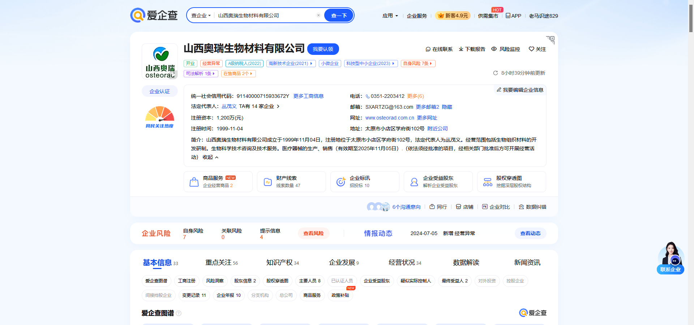
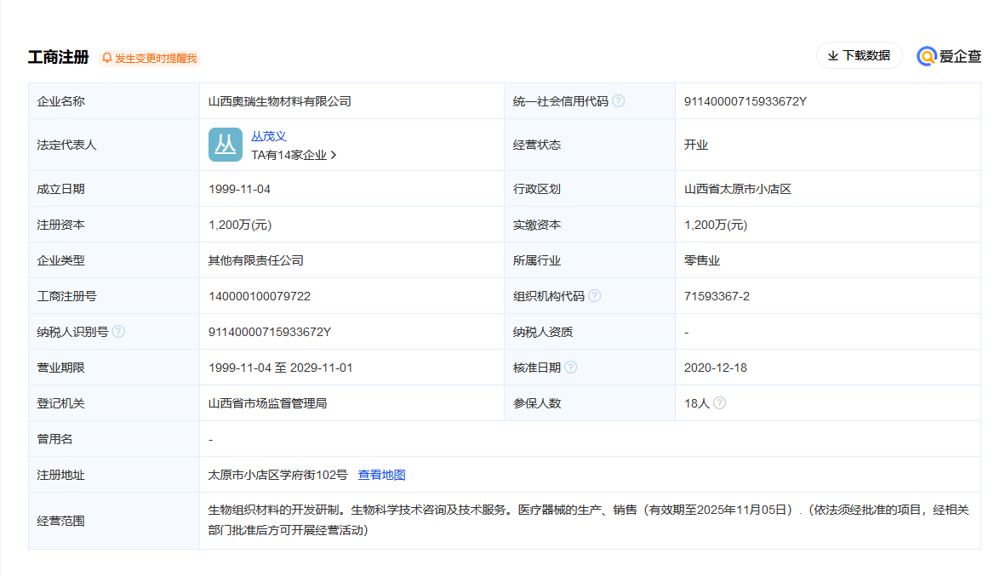

# 奥瑞生物材料涉嫌非法倒卖尸体

1. 北京勇者律师事务所主任易胜华公开了一起盗窃、侮辱、故意毁坏尸体案的《起诉意见书》。内容显示，山西奥瑞生物材料有限公司涉嫌从中国各地非法盗窃、倒卖数千具尸体，并进行粗暴肢解、剔除皮肉、清洗、辐照等，用于生产“同种异体骨植入性材料”产品。
2. 四川恒普公司是最大的尸体、残肢来源。奥瑞公司总经理苏成忠控制的中国西南地区四家火化场，向四川恒普公司提供了4000余具人体骨骼。
3. 此案的《起诉意见书》由山西太原市公安局在今年5月作出，已移送至当地检察院审查起诉。太原市检察院称，该案涉及面广，尚未办结，警方仍在排查嫌疑人。
4. 易胜华说，从中国法律来看，嫌疑人最多只会受到三年以下处罚且没有罚金，“这种事的发生，说明监管部门的严重失职，也说明法律还存在很大漏洞，必须要有改变”。
5. 刘东晨说，根据我国法规，“盗窃、侮辱、故意毁坏尸体、尸骨、骨灰罪”最高法定刑为三年有期徒刑，且未设定罚金刑。本案中，如果检方以“盗窃、侮辱、故意毁坏尸体、尸骨、骨灰罪”追究犯罪嫌疑人的刑事责任，或将导致罪行与刑罚严重失衡，破坏刑法的罪刑相一致的基本原则。
6. 刘东晨认为，从公开资料的情况来看，山西奥瑞公司营业收入高达3.8亿元，其他各涉案单位及相关人员也都获得了巨额非法利润，并且各个单位之间形成了庞大的“同种异体骨植入性材料”产、供、销产业链条，规模庞大，盗卖的尸体数目惊人，严重扰乱了公共秩序，严重损害了死者家属对尸体、尸骨、骨灰的虔诚感情。中国有句老话叫做“死者为大”，如果仅仅对犯罪嫌疑人处以三年有期徒刑，且不能依法对之处以罚金，犯罪嫌疑人在服刑期满将依然拥有巨额的财产，这样的结果明显与广大民众的正义观念产生极大冲突
7. 刘东晨分析，本案中的违法行为侵犯了两类法益，一是社会的公共秩序，二是死者家属对尸体、尸骨、骨灰的虔诚感情。但遗憾的是，我国刑法并没有进一步对以盈利为目的，对盗窃、买卖尸体、尸骨等行为作出特别规定，因此在适用法律时，有些公检法机关只能以“盗窃、侮辱、故意毁坏尸体、尸骨、骨灰罪”来追究盗卖尸体、尸骨等行为。如果把尸体和尸骨解释为人体器官的话，本案的罪名可以考虑为“组织出卖人体器官罪”，《刑法》第二百三十四条之一规定，组织出卖人体器官情节严重的，可以处五年以上有期徒刑，并处罚金或者没收财产。
8. 刘东晨指出，本案涉及的企业包括山西奥瑞公司、四川恒普公司、云南水富市火化场、贵州石阡县火化场、重庆巴南区火化场、四川大英县火化场、桂林市殡仪馆、平乐县殡仪馆、永福县殡仪馆等多家单位，相应涉及到民政、医疗卫生管理、市场监督管理等多个部门。由此可见，尸体被盗卖，伪造捐献材料掩盖非法行为等，暴露出多部门的监管缺失。医疗卫生管理部门应当加强对人体器官、尸体捐赠的管理，制定切实可行有效的制度，特别是对捐献家属施行公开透明的跟踪措施，让捐献家属随时能查知捐赠器官尸体的确切用途和去向；民政部门对未作火化的尸体要加强管理，避免尸体被非法处置；市场监督管理部门对于“同种异体骨植入性材料”产品的产、供、销各个环节应当严密管控，坚决杜绝此类案件的再次发生。
9. 国药股份8月9日早间公告，公司注意到，8月8日，网络上出现了关于山西奥瑞生物材料有限公司涉嫌违法生产“同种异体骨植入性材料”的消息，引发社会广泛关注，并有部分媒体错误记载国药股份参与其中。为避免给投资者造成误导，现对相关情况说明如下：相关媒体报道所涉主体非国药股份。国药股份主要业务为医药批发，以药品经营为主。国药股份与山西奥瑞生物材料有限公司不存在业务往来，也不存在任何关系。
