# 智者寺略记

> 公历：2025年9月13日 农历：乙巳年 乙酉月 乙酉日 佛历：2569年7月23日

骑共享电动车从金星南街至金华江边上双溪西路上，共享电动车提示已离开运营区，折回金星北街西侧放置后，又走路折回双溪西路，沿着金华江江边柳树道上向东走到环城西路，经环城西路大桥跨过金华江到江北。折腾这么久，我才意识到金华交通不方便，在金华电动车是必须出行工具，这里交通和杭州不一样，杭州人口密集，不仅地铁和公交遍布城市各个角落，而且还有大量共享单车分布在城市肌体之上，出行十分便利，而金华这里地铁和公交少，共享单车多数以电动车为主，即使是占绝大多数电动车其分布点位也是稀少。

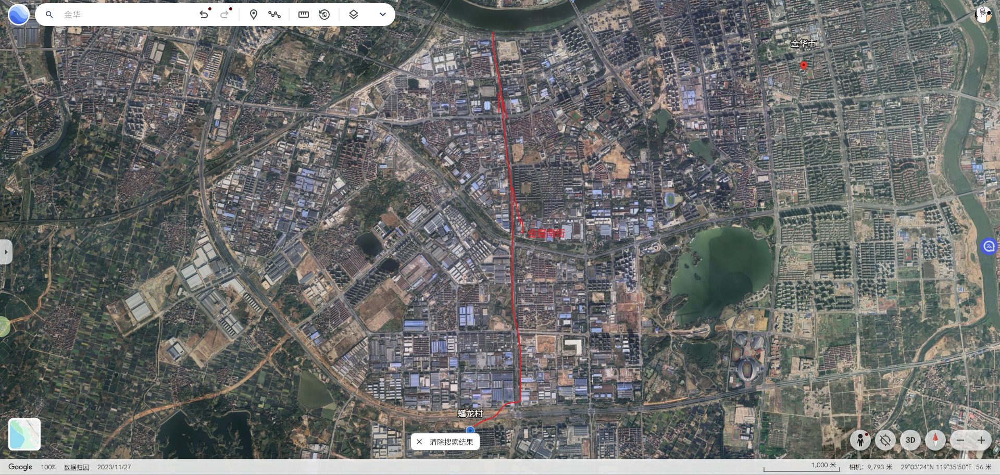

我顶着炎热太阳走路在环城西路上终于碰到一辆共享电动车，骑着它右拐至解放西路上，顺着解放西路到达凤凰花园，在里面转了一会，无果而出。接着沿解放西路进入解放东路，此时算是到了江北商业中心，商业繁盛，我在附近（麦当劳）金华帝壹城餐厅吃过午饭之后，又在店里小憩了一会，此时差不多下午三点多了。

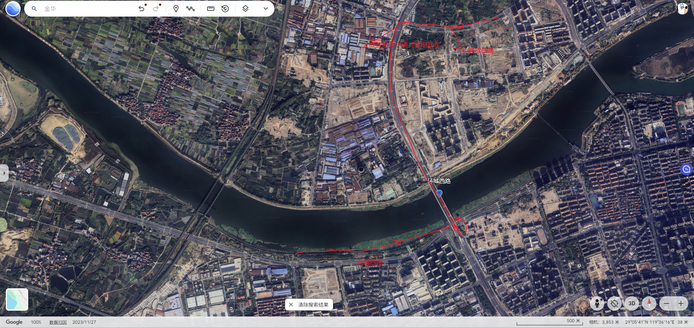

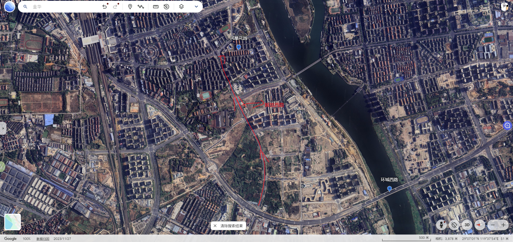

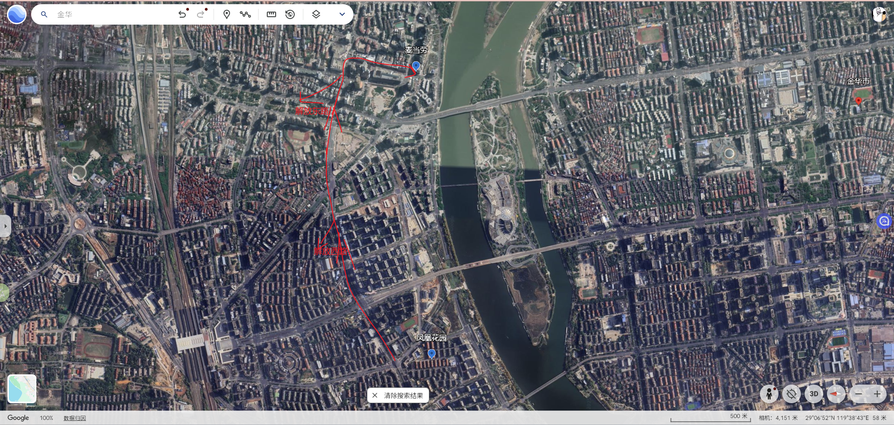

我在中山路找了一辆共享电动车，拐入八一北街向北驶去，在八一北街和迎宾大转接十字路口左拐至环城北路，沿环城北路右拐至北山路，在一个学院门口换了一辆共享单车，这也是难得机会，这一路上，我没有见到一辆共享单车，我如果骑电动车到智者寺，那非运营区电动车罚款肯定比单车要贵。骑着单车经过北山路至智者街，经智者街到罗山线，智者寺便在罗山线了。

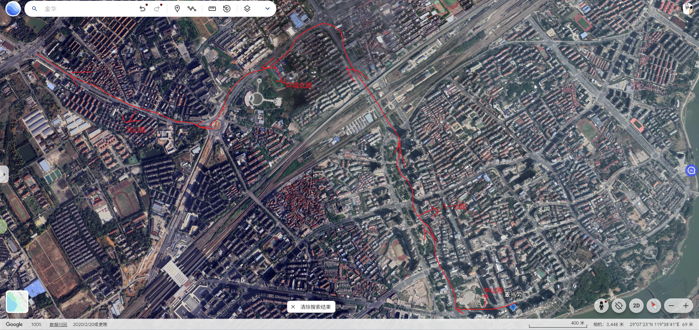

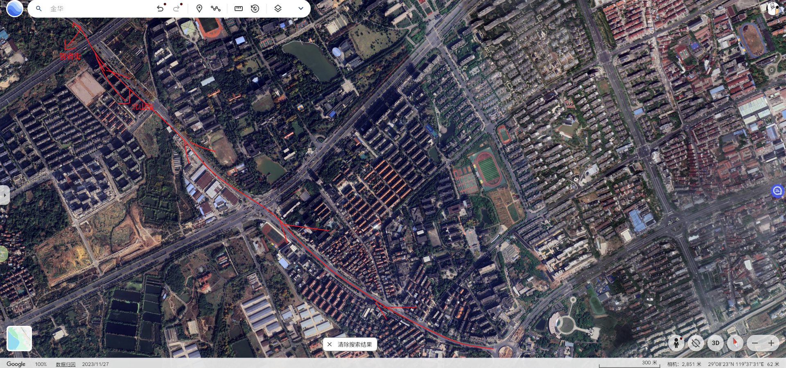

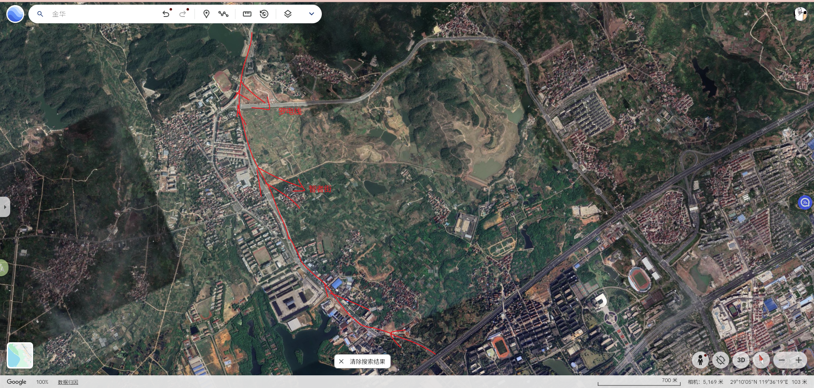

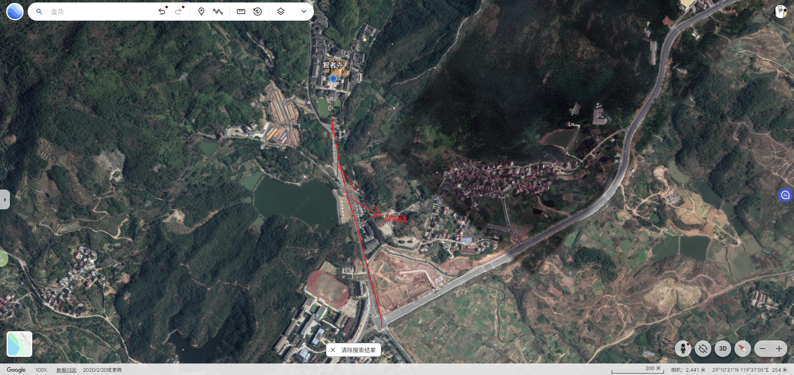

徐霞客游历足迹到达过这里，时人便树碑立传，以此提升寺院名气。但是我认为不必如此，这个寺院从建筑规模，建筑布局，建筑特点等方面来看，算得上中等，仅次于杭州灵隐寺这样大寺庙，不需要哪个名人特意背书烘托其名气。

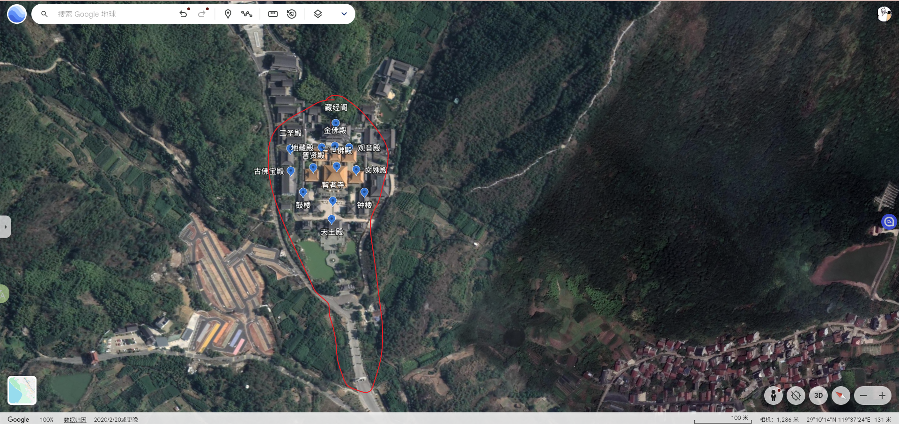

入三门四柱汉白玉牌楼，其上刻有佛佗浮雕以及对联，穿过两旁12柱经幢即到了智者寺山门处。

> 悟道金华山
>
> 智者乐法乐水法水长流慈津渡
>
> 共入昆虚性海
>
> 禅寺修福修慧福慧频臻皆如来
>
> 参禅智者寺

智者寺并没有居中轴线而坐，山门朝西南方向坐落，从右侧无作门入，两侧门角处是两尊忿怒状色彩鲜明金刚力士像。

> 出尘嚣而入清幽名山不远
>
> 三门清净万方贤圣常住锡
>
> 智者寺
>
> 万德庄严三界众生尽归依
>
> 积功德以开智慧佛性如来

进了寺院前面是一处池塘，在池塘中间七边形水台处，一家人在给池塘里鲤鱼喂食，躯干撑胀着好像要爆了一般的鲤鱼们迅速游聚在一块翻腾起激烈水花声争抢投落下来食物，这激烈抢食画面有点可怖吓人，没有一丝美好，就像一群丧尸分食落单活人一般，不远处黑色和白色天鹅见状也速游动过来抢食。寺院里大树主要是一些松针，白杨，水杉等，它们树干伸入高高天空之中，池塘边上种有一些尚小的银杏树，紫薇树上紫薇花依旧颜色浓烈状盛开着，灌木丛中有一些石楠，构树，苎麻，榔榆等。

天王殿内供奉有佛佗，佛佗两边佛像有点中性人，女性面容和姿态，男性身体，看上去有点怪异，两边有四大天王护卫，它们脚下有一些面容丑陋的恶鬼，我仔细看时，注意到一个天王护卫左手攥着一条蛇，后来看网上知道这是西方广目天王，它手上攥着龙或者蛇。

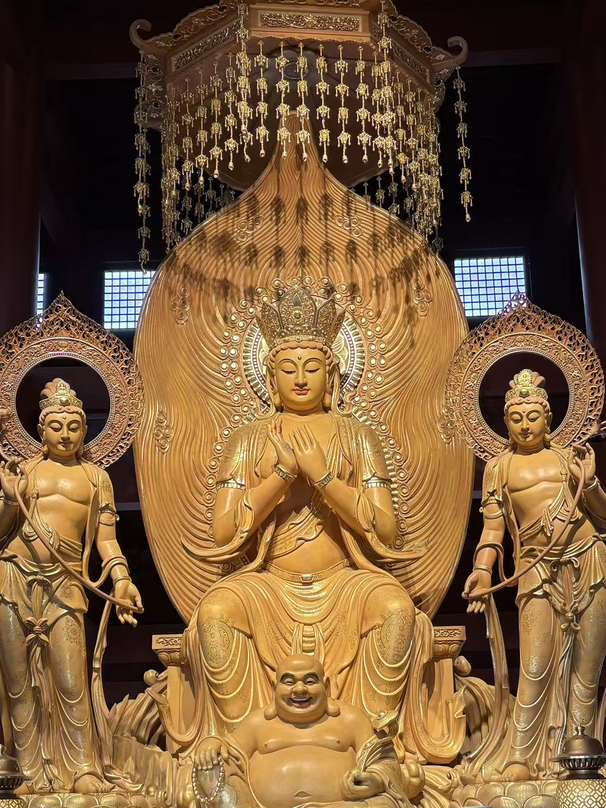

> 休嗟尘世难逢开心笑
>
> 五色慈云到处皆成欢喜地
>
> 四部州统领诸天大千世界
>
> 天王殿前门
>
> 八功水普施眾地不二法门
>
> 万年梵宇随时可悟去来绿
>
> 只怕人心不解看云浮

> ？？辈使阴谋放开大肚皮容物
>
> 五蕴六尘总是障尘欲澄前？皆净觉
>
> 天王殿内前
>
> ？天万法悉题心？能成妙果即慈祥
>
> 大肚能容容人间地？入何事不容

> 愿自家寻乐境使？笑面孔对人
>
> 证珈蓝永固心魔必去善果必成
>
> 天王殿内后
>
> 问邪惑安存宝杵常楎法轮常转
>
> 开口？笑笑古笑今？事？？笑

> 方寸心田广培神果
>
> 梦熟五更天几杵钟声敲不破
>
> 如此匆忙有甚事情难放手
>
> 天王殿后门
>
> 必然觉悟过此时日再回头
>
> 神游三宝地半山云影去？？
>
> 娑婆世界遍散？？

出了天王殿，两侧则是鼓楼和钟楼，再往则是三世佛殿，其佛殿前有两尊白象，其前两根高高石柱上分别坐着背靠背朝向四个方位四尊小狮子，其前四棵迎客松，其前四盆叶子花，纸质粉红色叶子花有些衰败状，其两旁有两棵繁盛无患子。

> ？则鸣？则洪法则？
>
> 钟楼
>
> ？者醒？？悟？？？

> 时洪时隐为世人警
>
> 鼓楼
>
> 入耳入心唯闻者知

我慢悠悠逛完三世佛殿两侧普贤殿和文殊殿后，寺院已经准备关门了，我在三世佛殿趁着僧人关门间隙拍了几张照片。在三世佛殿右侧石板上有一条已经晒干死亡张着口的小蛇，它很小，没有多长，但是是它着实吓了我一跳。

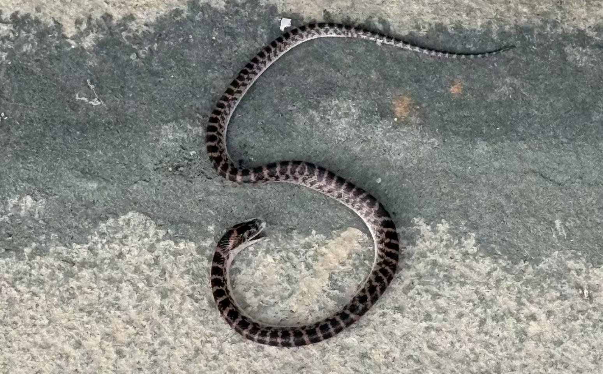

> ？？？？？？？？？？？？
>
> 来也空去也空缘何犯怨波恼？
>
> 此即鹫山？自在天机法？智者
>
> ？？金华智者？？？量佛
>
> 三世佛殿前门
>
> ？？觉？慈航？？者？人
>
> 佛？象教？真？本色光耀？？
>
> 慈斯在靈斯在即？瞻化日光？
>
> 奇观？？？？方？？？因？

> 涤？露法？恩波？绝？溪水
>
> 万出？芒？？？念明初地
>
> 文殊殿
>
> 一声狮吼喝退心魔净六？
>
> 坐莲花？座大慧？长？七佛？

> 普济十方迷津早自？溪渡
>
> 无欲望求六道修？真智慧
>
> 普贤殿
>
> 不生不减十方？？大光明
>
> 贤行万里觉？先？一？？

> ?静修持勿疆出尖峰入称智者
>
> 普贤殿内
>
> 弘深誓愿许宽容大海佛曰善哉

> 吵谛本雨空乐？住心修无住法
>
> 普贤殿内
>
> 大乘相指点圆三分愿尽十分行

> 继南朝衣钵重塑法身庆云开鹤舞鸾翔宝？莲花供法座
>
> 芙蓉呈宝相喜智者千秋衣钵双传古刹重辉三佛地
>
> 三世佛殿内
>
> 梵鼓接潮音念世人万种尘劳未释慈航普度十方身
>
> 传西竺香？？？眇谛梵钟起象鸣狮吼长山婺水震雷音

> 白云舒卷南望千峰秋月春光昭古迹
>
> 三世佛殿内
>
> 塔影横陈北临一水岁修时护焕新春

我从右侧穿过文殊殿到了藏经阁，后面一走廊横穿藏经阁，走廊两边石台上隔一段距离便盘坐着观音，两边高高石壁上挂着满壁小观音，这些观音像在蓝冷色调烘托下，有种宗教肃穆感，我转到正堂前，正堂同样是蓝冷色氛围，中间是一尊千手观音，周围是不同佛面观音，观音千面。

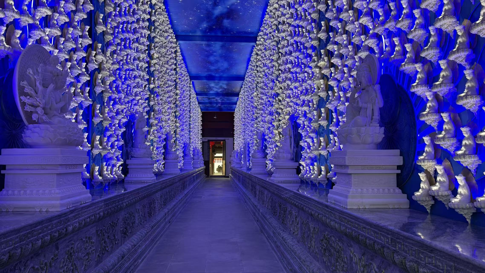

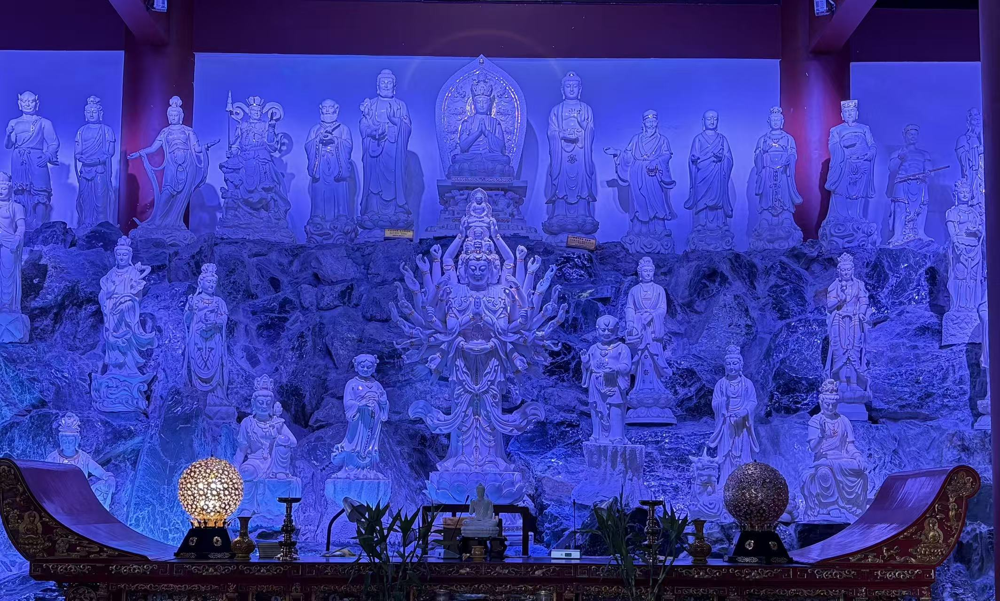

折回时，看到地藏殿，金佛殿，观音殿后面有对联

> 现丈六金身似见诸天龙象绕
>
> 地藏殿后门
>
> 持九環锡杖为防三界虎狼窥

> 慧日燦金华万象题禅昭真智者
>
> 金佛殿后门
>
> 曇云浮碧岫双龙德法悟大悲心

> 法雨慈云润一朵芙蓉开于净土
>
> 观音殿后门
>
> 甘霖圣水籍几枝杨桃？向苍生

侧面三圣殿有对联

> 我佛无言施雨露
>
> 三圣殿
>
> 有人一笑证菩提

智者寺两侧还有建筑，但是没有提供直接通道给游客过去，天色已晚，我也没有精力逛下去，便出来了，出汉白玉牌楼时，这一面也有对联。

> 诸恶莫做众善奉行
>
> 入僧伽蓝始弃贪念常怀慈悲
>
> 同登华藏玄门
>
> 度波罗蜜终舍痴嗔恒守正觉
>
> 自净其意是佛诸教

这个寺院到处有一些笑萌小和尚石像，状态各异，但是都是同一个笑容，同一张脸，它们多分布在水溪处。

