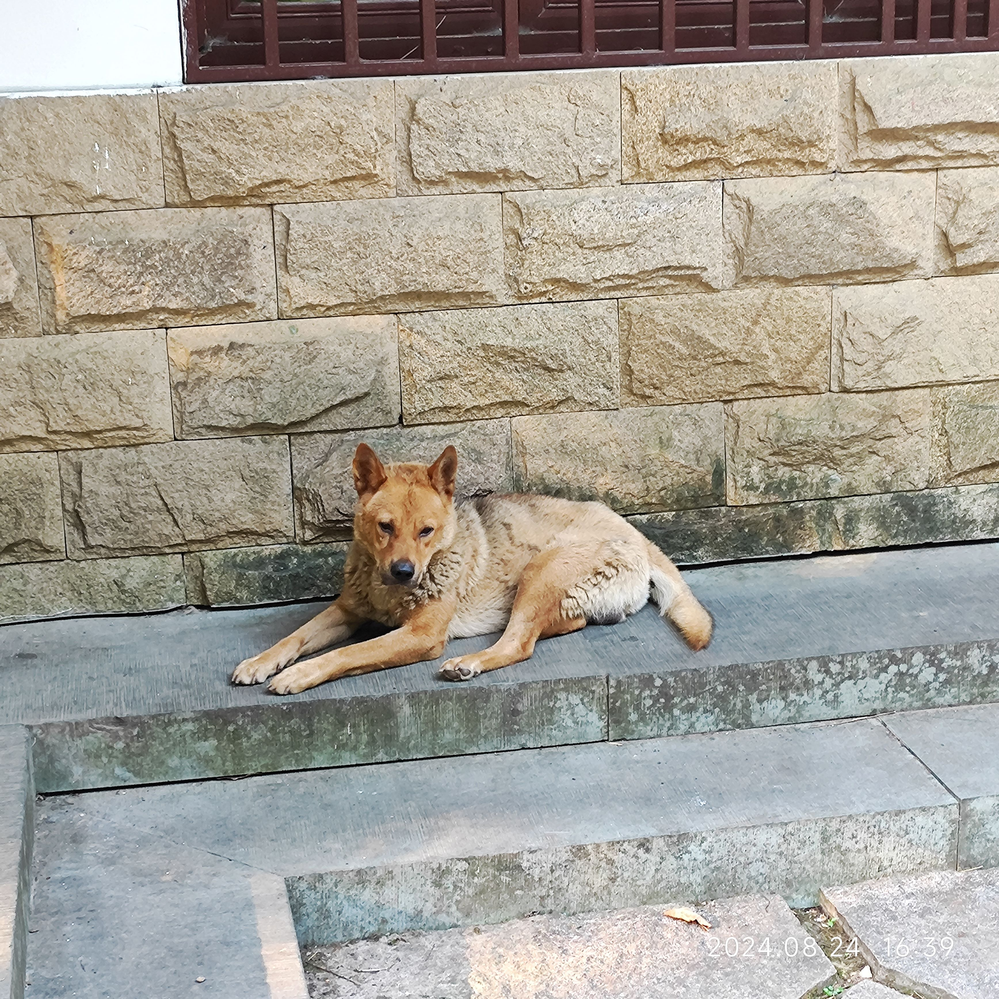
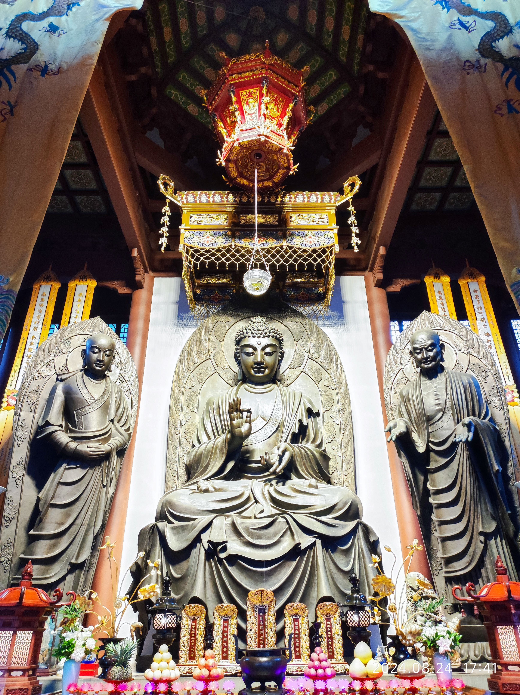
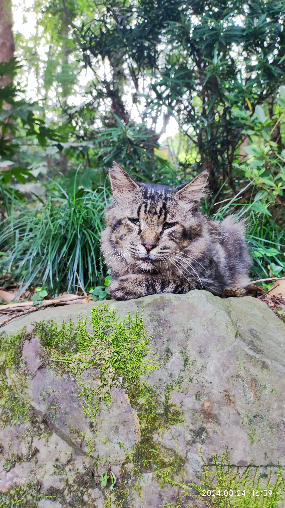

# 永福寺略记

韬光寺，永福寺，灵隐寺挨在一起，一般人是在首先在灵竺路和天竺路交叉口附近的东门，买门票进飞来峰，进来飞来峰之后，再买票进灵隐寺。8月24号周六下午，我是先到上天竺公交站的法喜寺附近，然后再沿着上山路到达永福寺的，那里也有一个售票处，当时前面许多人在买票，正好一辆观光车过来，前面的门打开，我便跟着过去了，没有买门票。今天我同样的路线到这个售票口，本来打算买票进去的，但是已经快五点了，天色渐黑，我便不打算进去了，在一边的长凳上坐了一会，五点时，售票人走了，其中一个保安大叔对一个女的说，五点之后可以免费进去，不用买门票了。我从旁边小道准备下山，没想到是一处停车场，又折返回来，前面那个女的在大门前没进去，我好奇的也到大门那里，大门紧闭，刚巧大门开了，原来是里面的工作人员骑着电车下班，我便进了永福寺，那个女的也跟着进来了。

​                                                       *从法喜寺上来时，经过一处，有一条第狗，今天再过来时，它还在，上面这张上次拍的*

永福寺这座寺庙的与众不同之外就是它是一座庄园式的寺庙，它的各个佛殿都是星罗棋布般分布在山上，而传统寺庙则将主要的佛殿居于中轴线上，中轴线两侧又是对称的堂殿，从布局这一方面来看，永福寺是一个少有的异类。

永福寺主要由普圆净院、迦陵讲院、资岩慧院、古香禅院、福泉茶院等组成，依山路而上，这些佛院便依次而建，虽然两次过来永福寺，但是这些佛院印象不全怎么深刻。唯一深刻的是资岩慧院中的大雄宝殿，资岩慧院有两棵树，一棵是香樟树，另一棵高大粗壮，枝叶繁盛，但是我不知道其树名，大雄宝殿内的释迦牟尼佛以及左右迦叶、阿难二尊者，它们的佛像漆上的是一层青铜色，表面富有光泽，它们的颜色令我印象深刻。大雄宝殿的大门两侧有对联：

> 慧日出云表如来不语但拈花
> 
> 宝殿临巅极湖山有意供点华

有时候，作为一个文盲，我是真的讨厌那些书法大师，写繁华体就繁体字，干嘛写的那么潦草，每次寺庙的对联，要么像甲骨文一样，一个也不认识，要么是繁体体，写的潦草至极，根本认不出来，而永福寺上的对联就是这两者都有。这些院落中的许多对联，我基本上没有一个能念全的。

在一处草丛处，有这么一副对联挺不错的：

> 风来疏竹，风过竹不留声
> 
> 雁过寒潭，雁去潭不存影

无论是在永福寺，还是韬光寺，还是灵隐寺，我今天经过时，四周的山上的溪流之声都格外的响声，山溪急流而下，水声浤浤汩汩。

