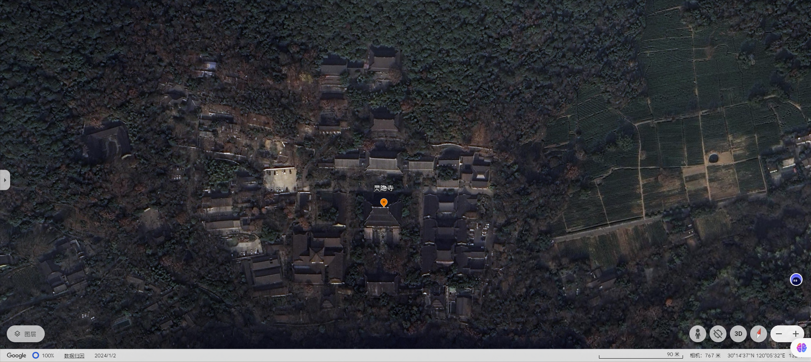

# 灵隐寺略记

> 农历 六月廿九 甲辰 [龙] 年 辛未月 己亥日

酷热的天气下，北高峰山下的汉堡店还有星巴克里面挤满吹空调的人们，我也是口干舌燥的在里面待了好久，才缓慢的恢复点精神。

买飞来峰的门票进去看飞来峰，如果再进里面的灵隐寺，则需再买灵隐寺的门票，我不解的是为什么要这样收门票。

飞来峰上遍布了许多的摩崖佛像，这个大规模的石刻佛像在我游历过的摩崖石刻中还是第一次见到。

灵隐寺的整体布局并没有位于南北中轴线上，而是有些偏斜。进去灵隐寺之后，我马上就感觉到了这是一座千年古刹，这种感觉完全迥异于我见过的其它任何一座寺庙，可能是灵隐寺历经千年的岁月沉淀下来的气质，庄严的佛意遍布在一切物象之中。后倒是没有什么可说的，倒不是让人大失所望，而是我实在太累了，也没有怎么观察细节。