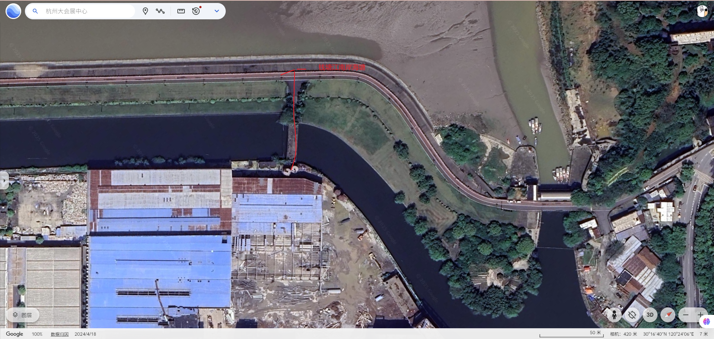

# 白虎山黄山庙略记

> 2025年5月31日 农历五月初五端午节 晴后有雨

前段日子去杭州大会展中心感受下CP31漫展的盛况时，注意到周围有几座山可以爬，便想着有时间过去看看。

今天中午时担心时间不够，便在竹苑巷菜市场买了两块饼放在背包里乘地铁过去大会展地铁站。出了地铁站，沿会展南路到达阳城路，穿过阳城路是一处新修的公园，公园里有公共厕所，有崭新的橡胶跑道，有大片金鸡菊等艳丽的花卉，和煦的阳光微风下，很多亲子们在绿色的草地上游玩。我穿过公园，经过一处不知名待完工的小桥到达钱塘江南岸海塘。

> 如下图，谷歌地图是去年2024年4月18日的，图像不准确，现在很多建筑都已拆除，我标注的地方现在已经是会展南路了。

> 如下图所示，如今已经是新开的公园了

> 如下图所示，穿过小桥到达钱塘江南岸海塘

在钱塘江南岸海塘本来可以好好的观赏下广阔的江面，但是这里竟然把岸边用铁柱给全部围了起来，上面标注类似注意安全的字眼，这个铁栏真的是折煞风景。这里游玩的人很多，看上去是在这附近居住的人，奇怪的是他们口音都不是南方人，真的是奇怪。有两男两女骑着电车在一块嬉戏，看上去都是十六七岁的孩子，真的羡慕小小年纪就知道谈对象的重要性，以我过来的人视角再看他们，倒是很羡慕，毕竟谈恋爱也就是少年或者大学时，人一旦步入社会谈婚论嫁，已经没有单纯恋爱可言，多是基于双方现实实力的对等交易。岸边上有许多搭帐篷野炊的人，我到一处河边坐了下来，打开书包拿出已经松软的饼，一瓶芬达自个吃了起来，我旁边是三个身体发福的中年妇女，听口音是北方人，她们三个在切西瓜吃，吃完一块便丢到河里，我望着她们，想着她们会不会分给我一块，没想到竟然成真了，西瓜太大，她们吃不完，然后分给了我一块，还是好人多呀！

饭后我便沿着观十五线准备到白虎山，但是我没想到真到了那里，却没有路了，在白虎山山脚下，建有小区，建有西式别墅，建有中式园林等，这些建筑直接把白虎山周围的路给圈住不让进了，这些有钱人是真的有钱，占山为王了，划为私产。

我只好又绕了一大圈从西北侧上山，上山时，碰到几个精力充沛的少年在骑着电动车玩耍，一个少年好心的说要载我上去，我给礼貌的回绝了。白虎山从地图上看，最大的是黄山庙，剩下较小的是杭州萧山区南阳甘露禅院，护国寺，高氏祠堂。

黄山庙其实也没什么特别的，它是一座新建的庙，没什么历史，庙里的的地板不像一些百年古刹踩上去有种历史的厚重，庙里也没有什么树木，非常的干净，我甚至没找到一处花卉，这里就好像一座普通的建筑，没任何的宗教气息在里面。我去过很多的寺庙，那里多多少少有种古朴的意境，宗教的厚重在里面，而在这里，我丝毫感觉不到，也许是建筑和布局导致的吧。

三大明王为啥叫三大明王殿，我也不清楚，里面分明是六个木制还没油漆的佛道像，两边是各16个小佛道像。

三大明王门前对联

> 钱江潮朝朝潮朝涨朝落
> 
> 浮云长常常长常长常消

三大明王殿里面有对联

> 如如不动俱足圆满普为利乐众生界
> 
> 念念相续无有间断恒不亡失菩提心

进黄山庙前，在三相门旁边的小门处，这个小门也算正常进入的门，有对联

> 福来财来平安来
> 
> 人顺家顺百世顺

黄山庙最里面圆通宝殿里供奉的是大慈大悲救苦救难南无观世音菩萨，也是木制还没油漆的状态。我准备走时，这里的男和尚和女尼姑到了他们的时间点，一块聚集到圆通宝殿里诵起经来，只是我听不懂他们诵经的内容。

后来我就下山了，经过龙虎村便出来了。浙江农村是真有钱，像龙虎村一样，依山傍水，建寺庙，建道观，建祠堂，家家建三四层的楼房别墅，尽管建的楼房别墅难看而且感觉住着也不舒服，但是就是有钱才能盖的。村民出门就是自家的池塘，没事就可以吃自家养的海鲜。出门就是柏油路，顺着山村里陡峭的柏油路直通大道上。南方植物丰沛，家家种种有鲜艳的植物，赏心悦目。这还是普通人家，像开发商直接占山圈地截路，盖一个高档小区，里面是小高层；可以靠着山下建一个中式园林，靠着山建西式别墅，这些高些高档小区，中式园林，西式别墅封闭管理，外人不得进入，把整座山当成了自己的私产一般。

