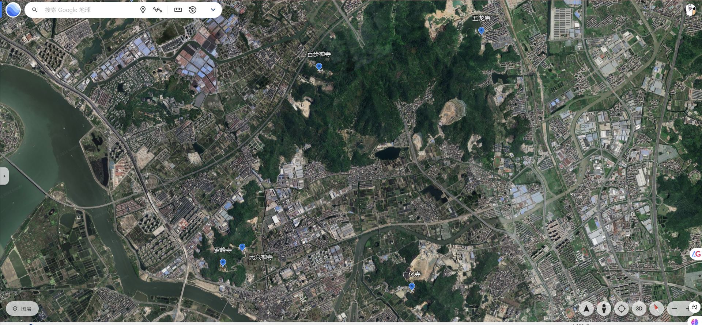
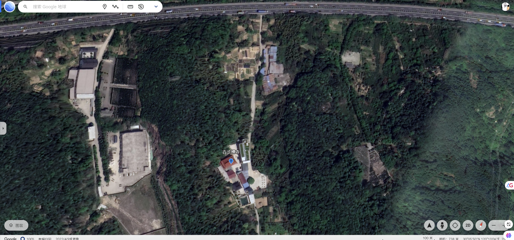
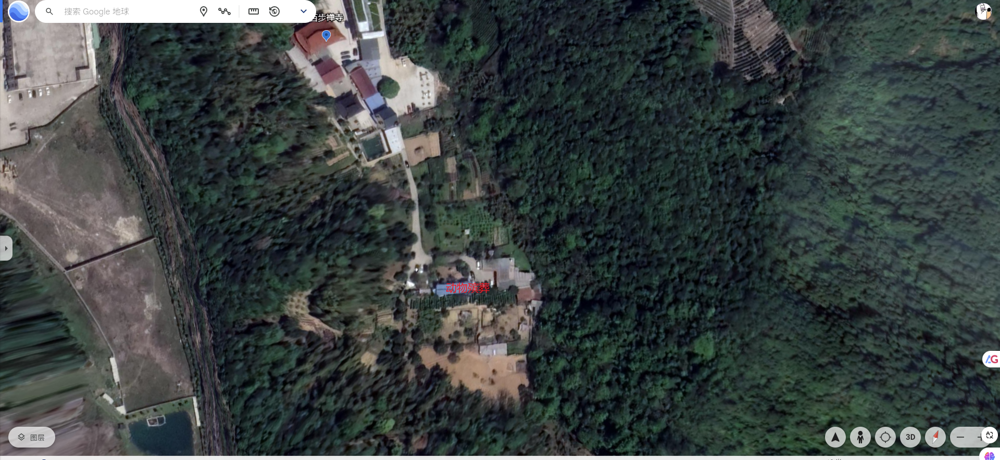
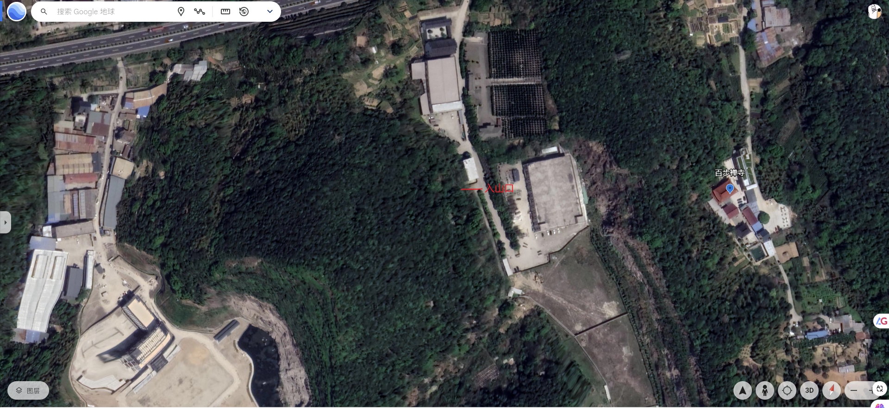

# 百步禅寺略记

南方这里适合居住的小山山周边多有人们在此定居点，同时这里又多会建有寺庙，山上又会多有坟墓，有时候甚至是规模大点的公墓。这是南方山陵众多的地理环境下人们定居的特点。

我今天花了40多块钱打车先到百步禅寺，这个偏僻的寺庙是我在浏览地图时偶尔看到的，后来我再顺着百步禅寺所在的山脉周围查看地图时，发现周边涉及的山脉也多有寺庙，诗句所云：“南朝四百八十寺，多少楼台风雨中”，是形容东南佛国的佛教兴盛，如今现实看来，这段诗句真的不是夸张语句。

近代以来，世界三大宗教，基督，佛，伊斯兰三者之中，基督的信徒们发现了自然规律，创造了技术，同时它的传教士们怀着上帝虔诚的信仰，带着这些科学和技术冒着生命危险，穿过无数可能死亡其中的大山，飘过无数可能死于其中的河流，经历各种可能死亡其中的极端天气和地理环境，艰难的跋涉到一切诸天人民所在之处，无论穷苦，无论贫富，无论偏僻，无论繁华，这些基督在人间的化身传教士们，在这些地方建立教堂，给周边的人民带来基础的生活服务，给他们提供基本的医疗，基本的温饱，给这些上帝还未眷顾的角落里带来科学和技术，带着上帝的信仰给这些上帝未眷顾的地方驱除愚昧，试图说服一切诸天人民成为上帝虔诚的信徒，因为神爱世人。

佛教近代以来则安静的多，貌似没有多大的传播力量，佛教告诉人们：“人生如梦幻泡影”。佛教在中国，或者说现在的佛教都是人们在供养它们，这些和尚们借着佛的信仰免费吃穿。

如今这个时代，寺庙还有佛的弟子们，让佛和世人的距离越来越远了。

而近代伊斯兰的信徒们，也越来越多，和基督的信徒们一样，在不断的增加新的信徒。但是伊斯兰的信徒们则一直生活在中世纪，他们拒绝科学和技术。他们生活在一个愚昧的信仰里。

基督借助科学和技术，以及给世人提供生活的基本物质这些外在的力量，说服民众成为上帝的子民，神爱世人。佛教借助佛的仁爱，佛学玄妙的佛法，许诺世人以慈悲为怀，多做善事，死后便可登极乐，究竟菩提，它以虚幻的死亡世界，痛苦的今生，快乐的来生来说服民众成为佛的信徒，佛家以慈悲为怀。而伊斯兰则是非我教类，其心必异，不是我们的信徒，就是我们的敌人。

百步禅寺位于杭州绕城高速上，它的往北方向不远处就是湘湖先照禅寺所在的山脉，百步禅寺位于山脚下，从山底入口往上走个十分钟左右就到了，禅寺内没有什么可说的，冷清的很，大雄宝殿内释迦牟尼下面有三四个披着僧衣的尘世之人，在讨论着尘世之事，见到我在寺内转来转去，警惕的问我是干嘛的。

> 十方隨喜善男信女共皈依
>
> 八面玲珑法雨慈云同拥护

> 静土法门十万诸佛皆共赞
>
> 莲幫樂國九家衆身同皈依

百步禅寺没有可说的，这里值得吹嘘的地方是历史人物贺知章，通往百步禅寺小道上还有专门他的简介，大意就是他回乡之后在这个寺庙待过一段时间。

> 少小离家老大回，乡音无改鬓毛衰。
> 儿童相见不相识，笑问客从何处来。

> 碧玉妆成一树高，万条垂下绿丝绦。
> 不知细叶谁裁出，二月春风似剪刀。

出了百步禅寺再往山上走时，有一处宠物殡葬的店面，我也好奇，为什么还会有这种业务，宠物死了就死了，还有人专门找人举行殡葬仪式。

再往时就没路了，我折返回杭州绕城高速时，天色已经暗淡下来，远处城市建筑尽头的太阳带着红色，我拿走手机想拍照，但是还没拍一两张，那夕阳已经淹没在地平线下面了。而另一头的满月的月亮的轮廓也清晰的显露了出来。

百步禅寺所在的山脉位于城区边缘了，相比湘湖那里的山脉，显得更荒山一些，虽然我也找到了一个入山口，但是入山口杂乱的枝叶说明这里很少有人过来，木尖山隧道横穿山脉而过。这里毕竟是城区边缘了，冷清点也正常。

