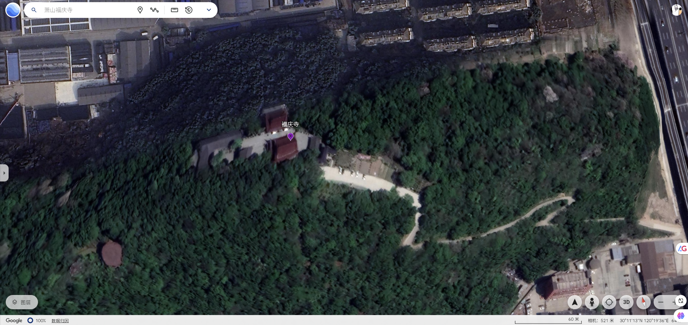
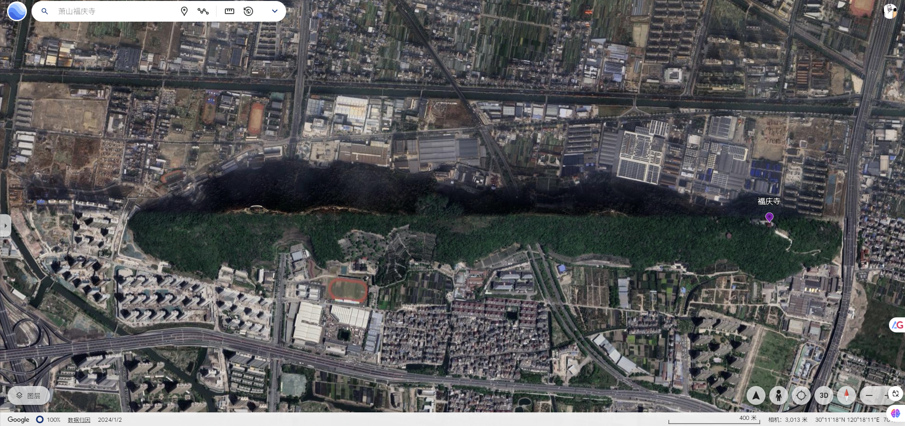

# 福庆寺略记-甲辰年丁丑月丁亥日

我顺着上山的公路到达福庆寺时已经是下午四点多了，我在长亭待了几分钟，再往下走时，里面的门便给关了，寺庙里的和尚给我说他们这里下午四点半关门，让我明天再过来，我看了下表，现在是四点二十分左右。这里的和尚工作真的好轻松。

我从福庆寺出来，然后又沿着东西方向的山脉从东侧走到西侧下山。这条山道平缓，很适合散步。这条山道曾经是抗击日寇的一个据点，保留了几处碉堡。

杭州真的是一个好的地方，这里没有什么高山，都是一些小山，很多的山都会建有寺庙，最多也就三四个小时便可以爬一座山，拜一回寺庙。古时候是南荒的地方，居住的人被称之为夷蛮的地方，如今却是整个中国的经济中心之一，果然是时移则势易。

如果能在杭州定居下来，真的是一件不错的事情，这里虽然潮湿多雨，但是这里长年最低温度在零度左右，天气温和。且有许多的小山河流供人游玩，这两优点的加持下，潮湿多雨这个缺点就完全无足轻重了。

这里的经济好，像一个旋涡一样吸引着北方城市的优秀人才过来打拼定居。高素质的人才不断的南下，北方流失大量的高素质人口，剩下的人口相比南方而言，你会明显的感觉到一种落后的精神面貌。暴躁，愚昧，无知，可怜，低智。你可以在河南无数的村庄里，甚至是郑州看到每逢平安夜进行的大肆反日反美宣传，但是这种事情绝对不会发生在南方。

能留在杭州，或者广州就是一种巨大的阶层跟踪，只是我没有那种水平，我甚至连一份稳定的工作也没有。2025年1月7日的时候，我被通知裁员了，连着几天我往返在西溪湿地北的劳动仲裁那里，耗费了许多的精力，却在2025年1月16日那天给随意的给签公司的裁员方案，公司像赶狗一样把我给撵走了。工作上的不稳定根本不可能有定居南方省会城市的可能。2017年毕业这么多年，再回想自已在社会上的经历时，真的感慨万千，后悔大学四年浪费了时光。我觉得大学四年作为进入社会时的过渡阶段，最应该干的几件事情：

1. 锻炼下心理承受能力，厚颜无耻在现在社会是一种强大优质的品质，出来社会，在男性社会里，就是赤裸裸的丛林社会，而厚颜无耻是你捕猎时最重要的利爪还有最重要的防护脂肪。
2. 多谈几段恋爱，有些花朵你不去摘，总有人过去摘，你过了时间，你再去摘时，剩下的要么是枯萎的花朵，要么已经是被人蹂躏过已经落入泥土中的花朵。
3. 明确自已以后干嘛，如果想从事计算机，那就学相关的知识。linux，C++，JAVA等等，了解整个计算机的世界涉及到的技术栈。如果想考研，就做好考研的准备。总之你能明确你以后干嘛。
4. 学英语，会一门外语。如果你会一门外语，在社会上，你就已经跑赢很多人了。
5. 出国，如果你没有任何优势，就出国吧！

社会就是个丛林社会，当你三十多岁才意识到这一点时，就已经晚了。