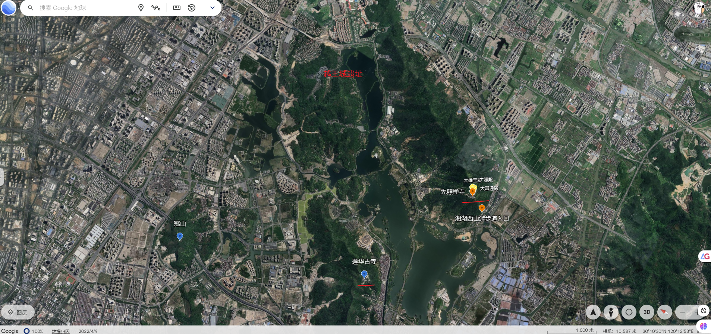
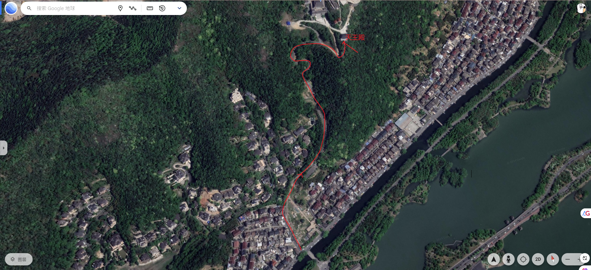
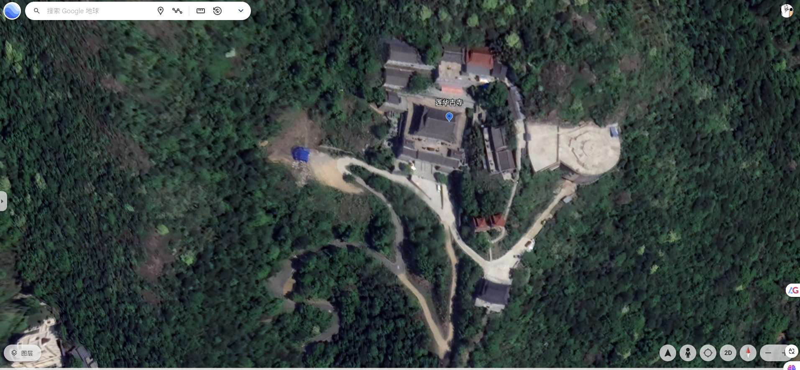
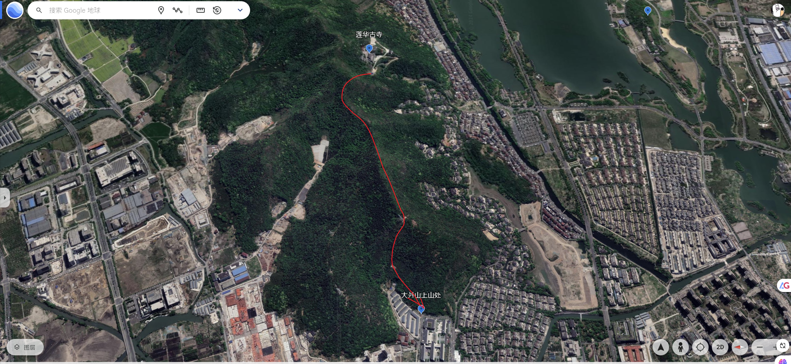
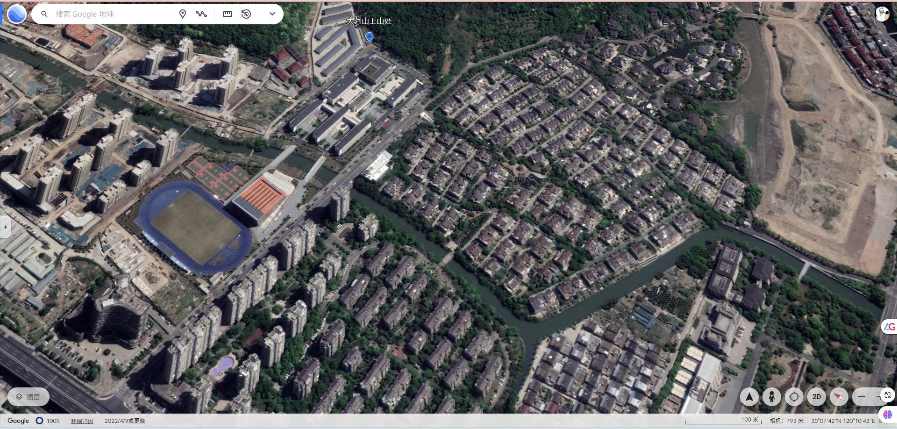

# 莲华古寺略记

莲华古寺大概位于湘湖东北侧，越王路东侧，湘湖周围有三座连续山脉。越王城遗址所在山脉，先照寺所在的山脉，莲华古寺所在山脉。莲华寺所在山脉的山脚下便是一些田地，村庄，小区，学校，公司之类人类活动区。

中午时我在王兄家吃了份他媳妇做的排骨，味道不错，就是量太少，吃了个半饱，我也不好意思说出来。午饭后， 王兄，他媳妇，他老妈，还有他尚在襁褓才三个多月大的儿子一块在湘湖附近转了下，他们一大家子有说有笑，场面温馨，我在其中有点多余的感觉，不知道我啥时候也有此温馨的生活。在外面带孩子有行动有诸多不便，他们一大家子还有我大概转了一会，王兄便开车带着他们一大家子回去了，看着他们开车远去的样子，我内心着实向往啊！

之后我则顺路去莲华古寺，莲华古寺不过在二百米山坡上，我不过十几分钟就到天王殿大门口了。

莲华寺的建筑不是中轴线的布局，我想可能如果按照中轴线来布局的话，花销太大了。莲华寺本身也没有多大的地方，加上当时佛殿都已经关门了，我匆匆逛过就离开上山了，也留意了一些对联：

> 顶天立地一心光明日月
>
> ?穴？潭三？？乾坤

> 净土莲花一花一佛一世界
>
> 牟尼珠？三摩三藐三菩提

> 慈悲喜捨度樊籠出迷津
>
> 信？行證入华藏之玄门

在莲华寺远眺远处时，可以明显的看到湘湖另一侧的先照禅寺上伫立的佛塔，莲花寺这里也同样有一座佛塔。湘湖边上的越王路，横穿湘湖的湘湖路以及湘湖路上的政和桥，镶嵌在湘湖中的零星小岛，界限明显的农田，方块方块的建筑楼。当时天色已经逐渐暗淡下来，视野尽头是连绵的群山以及钱塘江淹没在血红色的夕阳之中。

莲华寺有一座石老虎，它那剥落的陈旧外层无言的诉说着自己许久的朝代更迭历史，听说以前这里的虎口是出山水供人们食用的地方。

再往上就是山的最高处了，莲华寺往上最高处也不过二百五十米左右，在最高处再远眺远处的城市时，视野更加的宽阔，此时夜色已经来临了，山下的城市里，湘湖湖边的路灯，湘湖桥上的路灯，城市街道上的路灯，建筑高楼上每户人家的灯光，横跨钱塘江江面上桥梁的灯光等等，这些灯光一块点亮了整个山下的城市，我在山上看着下面满城迷人的灯光，感到十分的震撼。

我试图拿相机拍下这迷人的城市灯光，但是拍了几张都完全没有真实视觉上的一点感觉，便放弃了，手机相机很难清晰表达出如此壮观的景色，远处具体的细节它捕捉不了，涉及的巨大空间充满了巨量的细节，而相机的能量无法捕获全部的细节，拍下来的是一张大致轮廓的图片罢了。

后来大致沿着往西的方向走，期间都是一些生硬的山路，没有经过人工的修缮。直到大爿山5号碉堡那里，才到人工修缮过的山阶路上，期间碰到了一对错过莲华寺下山的情侣，我和他们一块到大爿山下山口分开，中间还碰到过几个母亲带着孩子过来爬山的，看来这个只有二百多米高的山脉是一个容易锻炼的地方。

