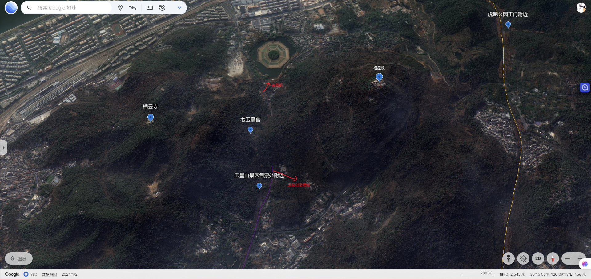
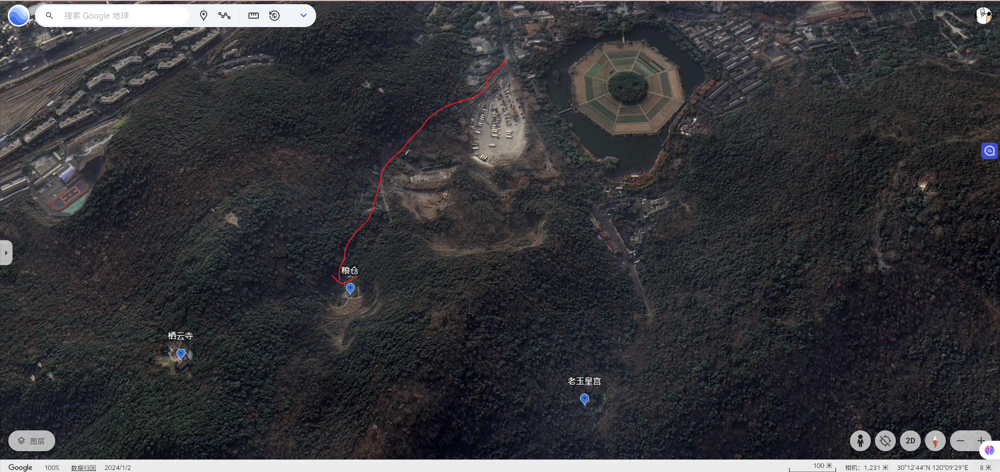
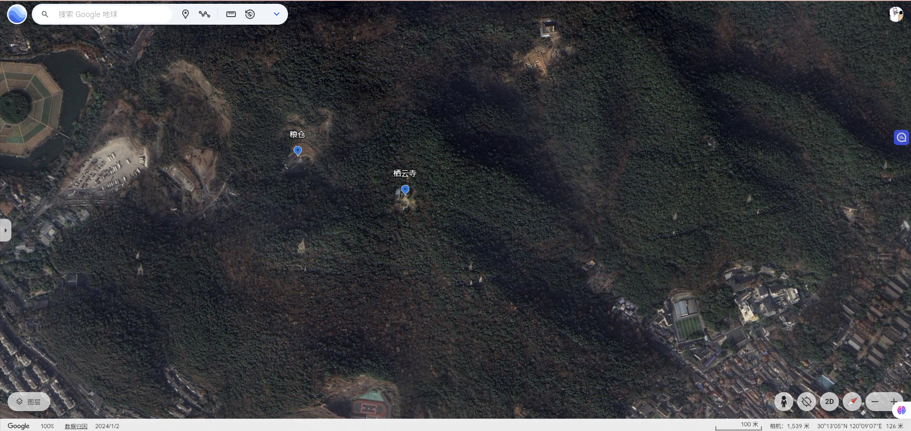
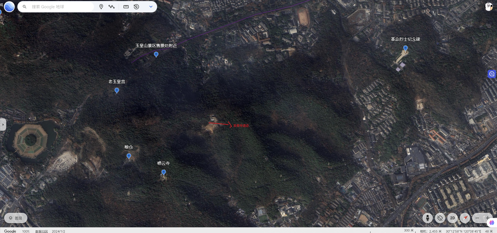
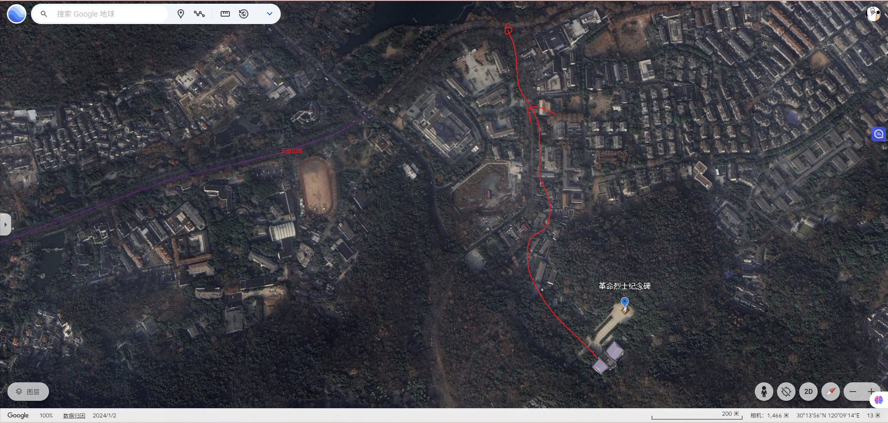

# 路过栖云寺

- **农历：乙巳[蛇]年庚辰月壬申日 公历：2025年5月3日**

先是骑车到玉皇山路附近，这里是玉皇山景区售票处的入口，然后穿过玉皇山路隧道到达南复路，南复路右侧就是八卦田。

在南复路的将台山地面停车场入口附近上山，我以为是一条上山的道路，等走了一段距离发现，是一家靠着山建设的粮仓，无奈只好原路折回南复路上。

经南复路到达南复路和大资福庙前路交叉口，然后再沿大资福庙前路到凤凰谷这里，凤凰谷这里我是后来查地图才意识到的，当时拐进来的原因只是因为这里能进来而已，前面大资福庙前路没有地方可以让我进去的，没想到在这里被我误打误撞的找到了上山的入口。

经过凤凰谷最里面一处有些杂草丛生无人打理的荒凉停车场，这里只有一两辆车停在这里，车上已经落满了树叶，积满了灰尘，看着停在这里很久没有人搭理的样子，真有点奇怪，这里离下面的房子只有几步远，下面还有保安在保安亭那里值班，这个停车场却没有什么人来。

停车场前面就是一条小路，虽然是很明显的一条小路，但是也很明显是一条不经常有人经过的小路，小路上杂草丛生，路两边的灌丛里总好像有野生动物冲出来的样子，我走在这里面心里总有些发怵害怕，等到一个分叉口的时候，我注意到前面的山下就是一处大的建筑，里面有传出人说话的声音，我顺着其中一条上山路接着上山，中间碰到好多坟墓，我更有些害怕了，杭州的人过世了，一般很多都会把新人的坟墓安葬到山上，我之前碰到过好多次，只要我走的上山路不是景区专门给修整的石阶路，而是少有人走偏僻小路，多半都会碰到很多的坟墓。

不过也没走多久我便看见了一座寺庙，这座栖云寺面积很小，只有几间房子，而且还在重新修整中，我便没有进去看，印象深刻的是这里有一只怕人的小狗阿黄。

接着我从栖云寺旁边的一处上山路上去，折腾了一会到达了正常的石阶山路，这里也逐渐碰到到好多的登山游客，在指路牌处看着地图我算是反应过来了，这里有将台山遗迹，是我去年来过的地方，这次我没有去将台山遗迹的方向，而是往圣果寺遗迹那里看看。

从圣果寺遗迹那里离开后，我就开始往下山路开始走了，最后是从革命烈士纪念碑附近那里下山的，那里附近有一处环形的桥，很有艺术感，以前我也来过这里，但是我不知道从这里可以上去玉皇山，环形桥是一处有名的网红打卡点，很多的人过来拍照留念，只是当时我没注意到这里会有一个上山口。还有一点是从地图上，我是怎么到达这里的，从山上到这里有一处村庄，似乎从山下下来应该是到的村庄，而不是环形桥那里？

从环形桥那里再下山时，经过革命烈士纪念碑就到达南山路这里了，这里我选择的是一条小路下山了，要是我沿着一条大路下山，我又回到了玉皇山那里，那里是我今天下午骑车经过的地方，这么算来，我是沿着玉皇山绕了一圈。记得去年时我从玉皇山下来时是一处深巷小区里，那里旁边开了一家冰激凌店，那时是大冬天，我还在冰激凌店花大价钱吃了一份名字是国外的冷甜食。

