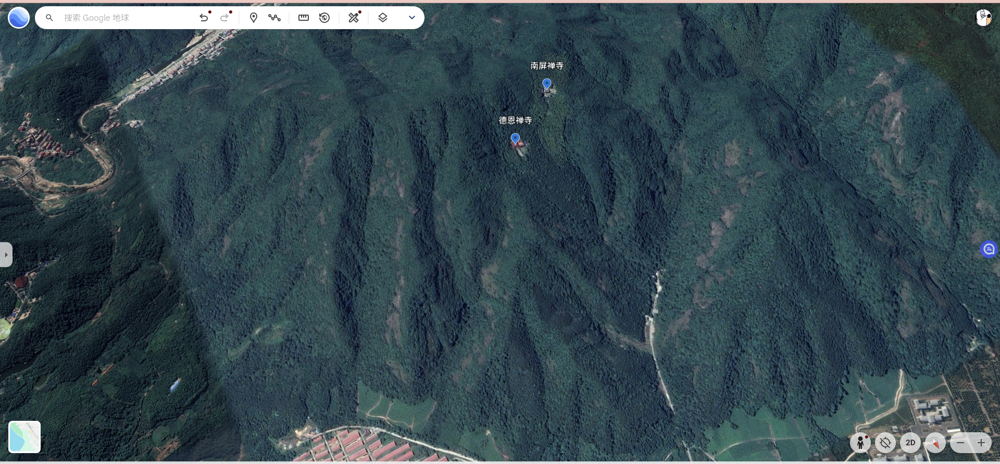

# 金华四顾屏德恩禅寺略记

乙巳 [蛇] 年 丙戌月 丁卯日 农历九月初五 2025年10月25日 周六

四顾屏山在金华婺江以南，四顾屏山再往南不远是安地水库，网上说它属于金华南山。我从蟠龙村出发，骑着我破自行车绕了许久才到达其山下，山下农田建有食用鸡养殖场，一眼望去，全是鸡群在农田乱窜和鸣叫。山下停了许多家用轿车还有几辆消防车。轿车是游客过来开来，消防车是团体游。

四顾屏山并不高，沿山道走，有两条道，往左是德恩禅寺，往右是南屏禅寺，德恩禅寺供奉南无地藏王菩萨。德恩禅寺小供奉台有诗句：

>庙小涵天地，像小愿深广。
>
>威德换磁场，桑梓居福藏。

其门有对联：

> 上报四重恩度他自度
>
> 晨钟一响唤醒苦海梦中人
>
> 下济三途苦觉他自觉
>
> 暮鼓三通惊动灵山方外客

从南屏禅寺而上则是野外徒步道了，都是过往人们踩出来土路，没有石阶，我本想从某个地方下去，但是现在时节五六点钟天便黑了， 吓得我跑着原路返回，再回到南屏禅寺附近，碰到一个人准备上去，我提醒其天黑了，上面是野路。而他则是本地人，笑着说上面路我熟悉。

再经过南屏禅寺时，天色已黑，小屋外面烧香台上燃起了几支红烛，周围是响亮蛩鸣声，小屋外是一位老僧人在缓慢打拳。

四顾屏山这里没有什么特别地方，两座禅寺很小，就几间屋子，不过四顾屏山可以当作一个徒步地方。
